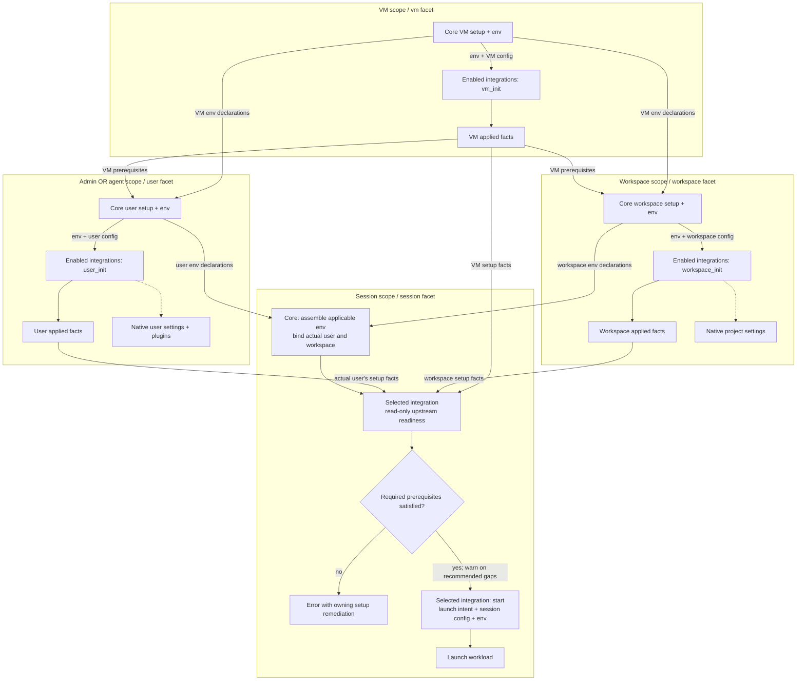

# Harness Scope Framework: High-Level Architecture

- Status: Proposed architecture for draft review; no merge or implementation intent yet
- Date: 2026-09-06
- Requirements: [FRD](frd.md), R1 through R16
- Saga: [next-steps](../2026-08-04-next-steps/target-state.md), wave 4
- Governing design: [scope participation](../2026-08-04-next-steps/scope-participation-contract.md)
  and [capability descriptors](../2026-08-04-next-steps/capability-descriptor-contract.md)
- Code baseline: `b22cc49c984aa91e8205e035c5766b5a2aede90a`

The
[operator's facets-first ruling](frd.md#operator-ruling-facets-first-artifacts-deferred-2026-09-07)
defers agent artifacts until the facets are in place. This draft carries the authorized FRD
amendment and architecture response together. Artifact ingestion, propagation, wire format,
persistence, and installation are follow-on work, including subagent definitions and evaluation of
Rulesync reuse. The saga lead owns reconciling superseded shared-contract wording.

## Architecture in one view

Each resource's existing lifecycle drives core setup and env preparation, then its explicitly
enabled harness integrations in declaration order. Core supplies the resource identity, execution
target, and applicable env. An integration receives only the config for the facet being invoked and
owns its native setup and applied facts. Session start checks its declared upstream prerequisites
and launches with accumulated env; it does not run ancestor setup as a side effect.



Env reaches each integration through its invocation's runner. Applied facts record successful setup
in the existing instance-state store; they are neither output config merged into the next facet nor
a new content store. Core derives env from existing declarations at the consuming operation. The
user and workspace branches are siblings, and a session uses its bound user's branch, never both
admin and agent. Admin setup follows VM setup within VM init; agent setup has its own lifecycle.
Native configuration stays at its defining resource, with the harness composing its own user and
project layers when it launches.

The pipeline is shared orchestration code, not a scope registry or extensible execution engine.
Resource managers retain activation, preflight, secret resolution, realization, error framing, and
rollback. Existing Python models, capability descriptors, transports, and SQLite instance state
remain the stack. There is no new runtime service or dependency. Harness setup uses the full
`Transport` after core makes it available; the native bootstrap channel is only an `ExecTransport`
and cannot be assumed to support file transfer.

## Where the current code changes

These anchors describe the baseline, not the proposed implementation's eventual line numbers.

| Existing seam                                                                 | Architectural change                                                                                                                                                          |
| ----------------------------------------------------------------------------- | ----------------------------------------------------------------------------------------------------------------------------------------------------------------------------- |
| `cli/agentworks/capabilities/harness_integration/base.py:202`                 | Separate common config binding from the session-only constructor, target guard, probe cache, and conversation state. Add setup invocation methods to this one registered API. |
| `cli/agentworks/capabilities/base.py:339` and `capabilities/config.py:517`    | Extend `config_for` and its cached model selection to preserve the facet in every downstream consumer.                                                                        |
| `cli/agentworks/capabilities/descriptor.py:159`                               | Replace the single hosted field assumption with the concrete hosting surfaces this effort introduces.                                                                         |
| `cli/agentworks/vms/initializer/driver.py:396` and `agents/initializer.py:31` | Prepare env and invoke integrations at each owning scope; remove Claude-specific dispatch.                                                                                    |
| `cli/agentworks/workspaces/realize.py:50`                                     | Run workspace participants inside the shared create body, before the workspace is declared complete.                                                                          |
| `cli/agentworks/env/entry.py:69` and `env/merge.py:19`                        | Reuse env declarations and the existing precedence ladder on setup runners, without persisting resolved secrets.                                                              |
| `cli/agentworks/db/instance_state.py:37`                                      | Register closed keys and compact domain codecs for harness applied facts; retain the existing table.                                                                          |
| `cli/agentworks/plugins/claude/harness_integration.py:129`                    | Own user plugin reconciliation, native user/project settings, and upstream diagnostics.                                                                                       |

## Resource ownership and attachments

The five setup/runtime scopes and four capability facets remain distinct. `OperationScope` currently
describes the command's identity and also includes a system level. It is not the five-scope setup
model and must not become the facet selector. Core's consuming resource chooses the facet once. A
scope names the resource/lifecycle boundary; a facet pairs the API methods and config an integration
implements. Each invocation belongs to a concrete resource. Admin and agent stay distinct scopes and
both use the user facet; core supplies the actual user identity.

| Owning scope | Config and selection surface                                    | Facet and operation          | Persistent owner          |
| ------------ | --------------------------------------------------------------- | ---------------------------- | ------------------------- |
| VM           | `vm-template.harness_integrations`                              | vm, `vm_init`                | VM                        |
| Admin        | Selected `admin-template.harness_integrations` (proposal below) | user, `user_init`            | VM, admin setup component |
| Agent        | `agent-template.harness_integrations`                           | user, `user_init`            | Agent                     |
| Workspace    | `workspace-template.harness_integrations`                       | workspace, `workspace_init`  | Workspace                 |
| Session      | Existing `session-template.harness_integration`                 | session, `start(intent=...)` | Session                   |

**List membership explicitly enables an integration at that setup resource.** Broader attachments
are ordered lists of tagged capability config blocks. Each block has the existing `name`
discriminator and only that facet's fields. A name-only block enables the integration with defaults;
there is no separate `enabled` flag. Multiple entries enable multiple integrations, each bound to
its own config and executed in list order. Duplicate names in one effective list are a config error.
An empty effective list selects none; default config or an implemented method cannot attach
anything.

Session selection remains singular and explicit through `harness_integration: {name: ...}`. A
selection declared by the selected template or inherited from a parent counts as explicit. If the
effective selection is absent, report a config error rather than silently choosing shell. Preserve
ordinary default shell use by giving the code-synthesized `session-template/default` an explicit
`name: shell` block (`sessions/kinds.py:82`), not by substituting shell during resolution.

An attachment does not enable its plugin globally, select a session workload, or implicitly attach
the integration to an ancestor or descendant. Existing plugin enablement and graph miss policies
apply, including the existing capability-enabled gate. Plugin availability is distinct from resource
selection: making a plugin available never enables its facets on every resource. One integration's
setup also cannot satisfy another integration's readiness prerequisite.

**Admin attachment proposal, for confirmation:** place selection and user config together on the
already-selected admin-template, using the same list shape and user-facet schema as agent templates.
The VM already records `admin_template`, selects it with `--admin-template`, and supports an
independent `--admin-spec` overlay (`cli/agentworks/instance_specs.py:105`). This avoids a second
admin selection/config join on the vm-template. FRD open question 3 explicitly asks about a
vm-template spelling, so this is a proposed answer requiring confirmation, not a silent amendment.
If a separate VM attachment is required, settle its ownership before the plan and LLD.

This changes every silent session-template lineage, not only `default`. Remove the fallback in
`sessions/templates.py:276` and finalize validation at `sessions/template.py:125`; the standalone
dictionary resolver follows the same rule. Reference edges then reflect the explicit effective
selection, including the synthesized default. Config-only child templates still inherit their
parent's selection. Existing named templates with no effective selection need an explicit block or
an explicit parent selection before use.

For inheriting templates, the attachment list replaces as a whole when authored by a nearer layer;
omission inherits and an explicit empty list removes the inherited selection. Each block still uses
its model's defaults and validation. This makes effective execution order explicit without adding
list-item patching, dependency declarations, or integration priority knobs. The admin-template keeps
its existing non-inheriting behavior, and instance overlays follow the same field policy.

## Facet config is ordinary capability config

Keep `config_model` as the single-config declaration and `config` as the bound validated instance.
Extend `config_for(facet=None)` rather than adopting the old `config_at` sketch or shadowing the
bound `config` property. A single-config capability ignores the optional selector and remains
unchanged. `HarnessIntegration` supplies the session-only default mapping for existing integrations:
its `config_model` is the session answer and setup facets offer no config. A multi-facet integration
overrides `config_for` for the fixed vm, user, workspace, and session vocabulary. Calling a
multi-facet selection without the consumer's facet must not silently select session config.

No offered model means an attachment accepts its selection tag and no config fields. It still may
invoke a method. Offering a model is neither a support claim nor a permission to invoke anything.
Only the harness kind enumerates the four facet answers during registration/finalize; ordinary
capabilities do not acquire per-facet declaration tables or new obligations.

Core records each hosting field's selected facet alongside its existing capability-block metadata.
Admin and agent hosting fields both select user. Harness reference output groups all four facet
schemas, including an answer with no config; a reference to a particular resource field renders
exactly that field's answer. The frozen descriptor carries a sequence of hosting surfaces with
singular or list cardinality, replacing its current one-field assumption. That metadata describes
consumers; implementations never receive a consumer kind as their config selector.

The model selected and checked at registration remains the model used for validation, merge,
references, secret extraction, and schema output. Extend the current offered-model cache by facet;
retain the current declaration-sensitive cache identity so registration, declaration replacement,
and snapshot restoration cannot reuse a mismatched answer. Cache tagged unions by kind, selected
facet, and the actual selected model arms. Preserve effective-layer validation and provenance,
including errors pointing to the block and declaring resource.

The pre-design call-site walk identifies these obligations:

| Consumer                                                                              | Required behavior                                                                                                                                               |
| ------------------------------------------------------------------------------------- | --------------------------------------------------------------------------------------------------------------------------------------------------------------- |
| `capabilities/config.py`: structural references, construct validation, and model maps | Receive the hosting field's selector; choose one model per blob.                                                                                                |
| `capabilities/conformance.py`                                                         | Validate all harness answers at registration and retain the public `register_plugin` boundary checks for non-callable hooks, invalid models, and hook failures. |
| `capabilities/base.py` constructor                                                    | Bind config and extract secrets from the same cached selected model; do not make a second uncached hook call.                                                   |
| `manifests/field_tree.py` and `manifests/reference.py`                                | Render the correct facet at a resource field and all facets at the harness capability root.                                                                     |
| `manifests/spec_model.py`, `manifests/decode.py`, and schema walkers                  | Walk every attachment element with its index, facet, and owner; preserve tagged shape, shorthand policy, reference edges, and value-safe errors.                |
| Secret backend primary and mapping config                                             | Keep their ordinary config behavior and distinct `mapping_model` contract. They are not harness facets.                                                         |

The registries themselves are already typed. Narrow the heterogeneous descriptor accessor's class
type where needed and remove only wrappers made unnecessary by that change. `mapping_model` is a
separate contract, not residue to fold into this migration. Do not combine this work with unrelated
capability cleanup. The hook's public caller boundary remains real even while implementations are
first-party.

## First-party facet config and worked examples

These are the proposed facet assignments for all four shipped integrations. Existing session models
keep their fields, types, defaults, merge behavior, and launch semantics. Each block still carries
its integration's literal `name`; the hosting resource chooses the facet, so config never nests
under a `facets` key. "No fields" below means a name-only attachment, not a claim that the facet
cannot perform work. Claude Code and Codex now both have user and workspace setup config,
independent of their existing session settings. Shell and Grok retain no-op defaults at all setup
facets; the VM facet remains part of the framework even when current integrations need no VM work.

| Integration name | VM config | User config                                                                                           | Workspace config                           | Session config fields beyond `name`                                                                                                                                                                                                                  |
| ---------------- | --------- | ----------------------------------------------------------------------------------------------------- | ------------------------------------------ | ---------------------------------------------------------------------------------------------------------------------------------------------------------------------------------------------------------------------------------------------------- |
| `claude-code`    | No fields | `marketplaces: list[str] = []`, `plugins: list[str] = []`, `settings: SettingsMapping or None = None` | `settings: SettingsMapping or None = None` | `permission_mode`, `model`, `reasoning_effort`, `goal`, `initial_prompt`, `agent`, `append_system_prompt`, `remote_control`, `vim_mode`, `terminal_bell`, `extra_args`                                                                               |
| `codex`          | No fields | `marketplaces: list[str] = []`, `plugins: list[str] = []`, `settings: SettingsMapping or None = None` | `settings: SettingsMapping or None = None` | `model`, `sandbox`, `approval_policy`, `profile`, `network`, `approvals_reviewer`, `reasoning_effort`, `goal`, `initial_prompt`, `agent`, `developer_instructions`, `vim_mode`, `writable_dirs`, `web_search`, `disable_strict_config`, `extra_args` |
| `grok-build`     | No fields | No fields                                                                                             | No fields                                  | `permission_mode`, `model`, `reasoning_effort`, `sandbox`, `goal`, `initial_prompt`, `agent`, `rules`, `extra_args`                                                                                                                                  |
| `shell`          | No fields | No fields                                                                                             | No fields                                  | `command`, `resume_command`, `required_commands`                                                                                                                                                                                                     |

Session defaults remain concrete: shell uses empty strings and an empty command list; the three AI
integrations default nullable options to `None`, boolean switches to `False`, and lists to `[]`.
Codex's `network` and `disable_strict_config` are nullable booleans; `web_search` remains
`bool | str | None`. Its `web_search: false` leaves the native setting alone, while `"disabled"`
explicitly disables search. Existing model definitions are the field-level contract:
`plugins/claude/harness_integration.py:53`, `plugins/codex/harness_integration.py:129`,
`plugins/grok/harness_integration.py:43`, and `capabilities/harness_integration/shell.py:53` under
`cli/agentworks/`. The LLD must carry these complete schemas into reference and validation fixtures,
preserving their defaults and their existing distinction between fresh and resumed launches.

Claude's existing marketplace/plugin configuration migrates to its user facet, renamed from
`claude_marketplaces`/`claude_plugins`. Codex user marketplace/plugin setup and settings mappings
for both are new in this effort. Workspace plugin installation remains follow-on work; it is not
inferred from the existence of a project settings file. Do not copy session knobs into user config
just because a harness can also store them in a native user file. CLI installation still uses the
existing `user_install_commands` surface. Codex's `profile` remains a session selection of native
config; it does not implicitly attach or run a user facet.

For example, these proposed manifests put plugin setup on the user, native project settings on the
workspace, and workload policy on the session. The marketplace and plugin names are illustrative
operator-owned values; plugin enablement and the ordinary VM/workspace selection still apply. These
new setup attachment fields become valid when this effort implements them.

```yaml
apiVersion: agentworks/v1
kind: agent-template
metadata:
  name: team-claude
spec:
  user_install_commands: [claude, codex]
  env:
    TEAM_REVIEW_MODE: careful
  harness_integrations:
    - name: claude-code
      marketplaces: [example-org/team-plugins]
      plugins: [reviewer@team-plugins]
    - name: codex
      marketplaces: [example-org/codex-plugins]
      plugins: [reviewer@codex-plugins]
      settings:
        source: file::~/.config/agentworks/codex-user.toml
        strategy: merge-preserve
    - name: shell
---
apiVersion: agentworks/v1
kind: workspace-template
metadata:
  name: team-project
spec:
  harness_integrations:
    - name: claude-code
      settings:
        source: file::~/.config/agentworks/claude-project.json
        strategy: merge-overwrite
    - name: codex
      settings:
        source: file::~/.config/agentworks/codex-project.toml
        strategy: skip-existing
    - name: shell
---
apiVersion: agentworks/v1
kind: session-template
metadata:
  name: team-review
spec:
  harness_integration:
    name: claude-code
    permission_mode: default
    initial_prompt: Review the pending changes.
```

Creating a user from `team-claude` installs both CLIs through core setup, prepares its env, then
invokes Claude and Codex user facets with their own marketplace/plugin lists. The name-only shell
attachment explicitly selects its no-op setup. Codex maps the selected workstation file to its
native user settings using the stated strategy. Creating a workspace from `team-project` runs
Claude, Codex, and shell workspace facets with separate config; Claude and Codex map their project
settings, while shell performs no setup work. A name-only attachment enables default behavior and is
distinct from omitting the integration.

A `team-review` session using those resources gets session config, applicable env, and upstream
readiness facts; user config does not become launch flags. The same user block is valid on the
proposed admin-template attachment surface. Putting `permission_mode` in the user block or `plugins`
in the session block is a facet-specific validation error. The user's Codex attachment does not
implicitly attach Codex to the workspace or select it for the session. With no inherited attachment,
omitting the workspace list selects none; an explicit empty list removes inherited selection. To use
Codex for a session, select `name: codex` in that session's singular block.

All four integrations retain ordinary session-only use when setup is not requested. These are
alternative `session-template.spec.harness_integration` blocks, each paired with its existing
CLI-installing agent template where needed:

```yaml
# With example-codex; existing session settings remain here.
name: codex
sandbox: read-only
approval_policy: on-request
---
# With example-grok; existing session settings remain here.
name: grok-build
permission_mode: default
---
# Explicit shell selection needs no plugin or setup attachment; defaults launch a login shell.
name: shell
```

Absent setup attachments do not by themselves prevent these sessions from launching. Each checks its
executable and any upstream prerequisite the integration declares. Name-only shell or Grok setup
calls remain no-ops, and the explicit default shell retains its ordinary launch behavior. No
artifact input, deferral result, shell discovery variable, or artifact cleanup method is introduced.

## Same config shape, separate native scopes

The integration may reuse config fields or a model across facets. Each attachment still binds a
different instance with its own origin, lifecycle, desired state, and applied receipts. Both Claude
Code and Codex have `settings` at user and workspace facets: the user mapping writes native user
settings, and the workspace mapping writes native project settings. Reusing that shape does not
merge the declarations. `marketplaces` and `plugins` are user-facet fields in this effort.

Template inheritance composes config for one owning resource; settings mapping merges into one
native file; the harness combines native user/project layers at launch. These are three separate
operations. Agentworks never copies user marketplaces, plugins, or settings into the workspace to
simulate inheritance. Native precedence and project trust remain the harness's responsibility. For
example, mapping a user's settings and a project's settings writes two different native files; when
they set the same native key, the harness decides which applies in that project. It does not cause
Agentworks to overwrite the user's file with project values.

**Workspace plugin installation is a follow-on, not an offered field.** Claude documents a project
association in `.claude/settings.json`, but also cases where each user must install the referenced
plugin before it loads. Codex provides marketplace/plugin commands and project TOML configuration;
the installed CLI's plugin-add help does not establish a project install path. Neither observation
alone proves user-independent workspace provisioning. This revision therefore offers no workspace
`marketplaces` or `plugins` field for either integration.

A follow-on must prove actual applicability with two users and two workspaces. If installation needs
a user identity but can remain restricted to that user in the originating workspace, deferring it to
the session could be valid. A global user install would still be wrong. That would also require a
native setup deferral contract, with origin, applicability, per-user completion, and native
association/cache ownership; it must not be smuggled into hint/rule/skill payloads. It is not needed
to deliver this effort. Repository-owned project settings, rules, and skills provide the immediate
project customization path; mapping settings alone makes no promise to install referenced plugins.

## Mapping workstation settings

`SettingsMapping` is a native setup config value, not a new agent artifact kind. Initially each
attachment maps one file to the integration's ordinary settings role for that facet. The integration
chooses the destination and native parser; no arbitrary guest destination or filesystem-sync engine
is added. The shape is `settings: {source: <source reference>, strategy: <policy>}`. Both fields are
required when `settings` is present; omission means no mapped settings.

Reuse the local-file spelling and path rules of `SourceRef` (`cli/agentworks/sources.py:41`),
accepting `file::` or an ordinary workstation path. This settings surface initially accepts local
files only; Git-backed settings acquisition is follow-on work. The shipped `fetch_file` writes to a
guest transport, and its Git branch clones on that guest; it is not a workstation validation helper.
Add a small shared workstation-file snapshot helper, then let the integration parse that captured
snapshot and use the existing transport to publish its resulting native document. Do not add a local
transport merely to fit the old helper's signature.

Acquire and validate the source before this integration's first native settings or plugin write;
core setup earlier in the pipeline keeps its existing lifecycle. Workstation paths use the invoking
process's home and working directory, never the guest's. Keep the captured bytes stable for the
operation, using temporary local storage where transfer requires a path, and clean it up on success
or failure. Transfer the captured result rather than rereading a possibly changed source at write
time. This is a snapshot, not a symlink or mount. Reinit rereads the source; session start uses
applied state and native files and has no workstation-source dependency.

| Integration | User settings destination             | Workspace settings destination    | Parser             |
| ----------- | ------------------------------------- | --------------------------------- | ------------------ |
| Claude Code | That user's `~/.claude/settings.json` | Workspace `.claude/settings.json` | Native JSON object |
| Codex       | That user's `~/.codex/config.toml`    | Workspace `.codex/config.toml`    | Native TOML table  |

Paths denote native roles, respecting any supported home override in the actual invocation.
Authentication/session files are not settings roles. Sources must be non-secret settings; declared
secret references remain on the existing resolution path. Do not archive settings bytes or resolved
credentials in desired/applied state, errors, or logs. Native paths embedded in settings are copied
as values, not automatically rewritten from workstation to guest; portable source files are the
operator's input.

The four strategies govern collision with the live destination:

| Strategy          | Behavior                                                                                                 |
| ----------------- | -------------------------------------------------------------------------------------------------------- |
| `replace`         | Replace the complete settings document with the source, including removal of destination-only keys.      |
| `merge-overwrite` | Recursively merge objects/tables; source values win at colliding leaves. Preserve destination-only keys. |
| `merge-preserve`  | Recursively merge objects/tables; existing values win at colliding leaves. Add absent keys.              |
| `skip-existing`   | If any destination file exists, leave that whole file unchanged; otherwise create from the source.       |

Arrays are atomic values, not concatenated or merged by position. When only one side is an
object/table, that whole value is a collision and the strategy's winner applies. Duplicate keys in
any document that must be parsed are rejected rather than depending on parser last-write behavior.
The source must parse even for `skip-existing`; an existing destination need not parse when skipped
or completely replaced, but merge requires a valid native document. A directory or unsuitable link
at the destination is an error, not a file to replace. Missing source or parse/type failure occurs
before destination writes. Native output must remain valid; merge is semantic and makes no promise
to preserve formatting.

For example, with existing `{ui: {theme: dark}, extra: true}` and source
`{ui: {theme: light, bell: true}}`, replace removes `extra`; merge-overwrite changes the theme and
adds the bell; merge-preserve keeps the dark theme and adds the bell; skip-existing changes nothing.
Reapplying the same source and policy is idempotent. These policies act on current destination state
on each reinit, including operator edits; choosing overwrite or replace expressly permits that
behavior. It does not grant ownership of unrelated native resources.

One invocation plans its settings changes as a unit. Explicit `marketplaces`/`plugins` config and
the settings document produced by the selected strategy must not silently fight over native keys or
identities: inconsistent desired declarations are config errors before writes, while matching ones
are reconciled once. Source values discarded by `skip-existing` or `merge-preserve` are not proposed
writes and cannot create a conflict by themselves. Treat native plugin commands that also edit
settings as part of that same plan, with receipts for their actual writes. `skip-existing` skips the
file mapping, not the separately declared plugin work. The LLD must specify native command ordering
and protect mapped settings against subsequent plugin-command rewrites; attachment order is not a
last-writer policy.

Applied facts distinguish keys/files written by the mapping from untouched content. A skip or a
preserved collision grants no ownership of the retained value. On removal of a mapping, leave the
settings file and its current values in place and relinquish only this mapping's claims; there is no
automatic restoration of overwritten workstation-independent values or deletion of an adopted file.
Report that settings are retained. Explicit removal of managed plugin associations remains separate
and may change their native keys. This is deliberately a provisioning policy, not a backup system.
Changing the source or strategy reruns the mapping at the next owning setup operation, subject to
other recorded owners and native validation. Workspace mappings retain the create-only lifecycle;
subsequent changes require workspace recreation until an owner-authorized reinit surface exists.

## Invocation API and execution

Retain `vm_init`, `user_init`, and `workspace_init` as the method names. Each receives a typed
invocation for its facet and reports applied facts through a manager-owned checkpoint channel.
Methods return normally on success and raise through the existing error framing on failure. Base
setup defaults perform no work and report no applied facts. Core records successful completion when
the selected facet returns; a no-op default does not prove a native condition beyond what actually
ran. The session `start` method retains `HarnessLaunchIntent` and the current launch-result
alternatives. No artifact parameters, output collections, or final-deferral check are added.

The contract version increments from 3 across the descriptor and all four first-party integrations.
`start` remains the required operation; inherited setup defaults satisfy R3 without a
supported-scope registry. Existing session probe obligations remain on the session path. There is no
new session cleanup operation for deferred artifact work.

Construct an integration binding for one owning resource and facet. A present attachment supplies
its effective config; an absent attachment supplies prior ownership for retirement without
validating absent config or inventing defaults. Both use the same facet method. Give setup methods
only the invocation that belongs to that resource: VM identity and system runner for vm; username,
home, and user runner for user; workspace identity, root, and setup runner for workspace. Each
receives prior applied facts for this integration, an applied-fact checkpoint channel, and an env
view carried by the runner. Core binds a user invocation to its actual user.

Session construction adds session identity, workspace, workload target, launch readiness cache, and
conversation state. None of those fields is required to construct setup bindings. Conversely, a
session binding is never lent to a setup operation. Existing readiness identity checks remain
session-specific; setup readiness belongs to its owning resource and lifecycle.

Run targets are lightweight views over existing transports with the invocation's env already bound.
They delegate file operations and execution rather than adding a transport implementation. Per-call
env can add command-specific values, while core identity variables remain authoritative. This is
convenience, not a sandbox: trusted integration code can access the underlying system, and review
enforces scope discipline.

VM initialization completes the VM pipeline before driving the admin pipeline. Agent initialization
runs independently on its VM. Workspace creation is VM-owned and does not choose an agent identity.
Existing orchestration orders prerequisites when session creation also creates resources; only those
explicitly requested creations may run setup. Starting an existing session never does so.

## Env delivery

Use the shipped `EnvEntry` shape: a plaintext value or a declared secret reference. Reuse the
existing precedence `vm < workspace < (admin or agent) < session`; admin and agent never merge.
Pipeline order within a scope does not change precedence. Core-protected identity variables win
last. User setup sees VM plus its user's env. Workspace setup sees VM plus workspace env, never an
arbitrary user's env. Session launch combines its actual ancestors and session declarations.

Resolve the existing declarations at the owning operation; there is no new producer-contribution
store. Bootstrap and core install commands retain their hermetic runners. The harness integration
lane receives the assembled env runner, extending today's runtime-only env injection. Declared
secret needs join the owning operation's existing preflight and resolution boundary. Runtime values
exist only in the operation's runner and scoped secret view. Persist neither resolved secrets nor
secret-derived hashes; resolve declared secret references afresh when needed.

## Future artifact work and Rulesync reuse

Artifacts belong to a separate SDD, the intended next effort after this framework, rather than a
later phase of this SDD. Complete and validate facets and native setup before settling the artifact
architecture. This is a foundation for the broader artifact-capable integration model, whose
completion requires the successor. The saga owns recording that sequence and establishing the next
charter. The successor can extend these facet interfaces; the current API is not claimed to be the
final artifact-capable API.

That effort must consider hints, rules, complete skills, and subagent definitions, with limited
hooks and MCP configuration also in view. Subagents carry their own invocation, model, and
tool-policy semantics; they cannot be assumed to be interchangeable with skills or prompt text.

Retain these design conclusions as context: core and future features can emit env and artifacts
before harness integrations; artifacts keep their originating scope, resource, and producer; native
placement ordinarily belongs at the defining scope; an integration decides placement and deferral;
and a session must not silently lose unhandled input. Workstation, Git, and possible packaged
sources should meet at one normalized artifact representation before propagation. Hints remain
distinct from rules and stronger launch instructions. These are inputs to the follow-on design, not
a frozen wire format, persisted schema, ingestion policy, or placeholder API in the facets
implementation.

There is no artifact or native-setup deferral protocol in this SDD. The successor must address
resources where an integration is not selected: skipping an invocation must not silently discard
applicable input or implicitly enable the integration. It must also resolve the diamond formed by
VM, user/workspace, and session. Sending the same VM item down both branches and deduplicating its
ID at session start would not alone prevent duplicate native effects. Treating a user-facet result
as globally consumed would wrongly hide work still needed for other users.

The open design questions are which intermediate facets receive inherited input, how origin and
destination-specific applicability distinguish obligations from duplicate paths, and how the
selected session integration reconciles applicable handling evidence and remaining input. Handling
for Alice or workspace X cannot automatically satisfy Bob or workspace Y. No routing, fan-out,
receipt-merge, or final-session selection algorithm is chosen here. The workspace facet currently
earns its place through native project settings mappings; keeping that setup surface does not
require inherited VM artifacts to flow through it.

The operator's leading follow-on proposal is a declarative `artifact-bundle` resource that owns
ingestion and normalized contents. Other resources would consume bundles by ID rather than each
implementing source acquisition. Bundle identity describes the source package; the consuming
resource establishes scope and applicability, and the harness integration chooses native placement.
The future design must distinguish bundle identity from the captured revision being consumed and
settle update, retention, and storage semantics. No resource kind or reference field is added here.

Evaluate Rulesync reuse before building a parallel converter. Its
[canonical file formats](https://rulesync.dyoshikawa.com/reference/file-formats.html) already cover
rules, skills, and subagents, and its
[programmatic API](https://rulesync.dyoshikawa.com/api/programmatic-api.html) provides target
generation with separate source/output roots. Agentworks already uses Rulesync for its repository's
rules, skills, and subagents. That makes source compatibility and target rendering promising reuse
points. Agentworks must still own resource identity, facet invocation, explicit selection,
readiness, and idempotent lifecycle behavior. A follow-on should test whether Rulesync can operate
within those boundaries, including safe staging, complete package preservation, error reporting, and
ownership of writes and deletions. No runtime dependency, adapter API, or wholesale adoption is
selected here.

The artifact storage tradeoff remains unresolved future design work. The earlier investigation found
real JSON size and fleet-inspection costs; external content files add their own backup and lifetime
obligations. Likewise, session-local file placement and a stable session ownership identity need
assessment when artifacts are introduced. This effort no longer delivers the early `session_uuid`
slice proposed for that purpose; the shared identity contract remains with the saga and its sibling
consumers. Do not introduce artifact snapshots, shell artifact directories, special Git exclusions,
or an artifact cleanup protocol while delivering facets.

Features also remain future work. Preserve their position between core and harness integrations,
with `user-feature` serving both admin and agent users, but add no feature kinds, registration,
config, execution, dependency system, or test feature capabilities now. Automatic hints from env,
authentication, and other core setup wait with artifacts.

## Applied state and convergence

Use the existing instance-state store with a closed harness applied-state key and compact, versioned
domain records. The VM payload separates VM setup from admin setup; agent and workspace owners use
their own rows. Integration names separate records inside that payload. The store needs no new table
or generic record API. Conversation state remains in its existing session namespace. There are no
artifact contents, producer contributions, or deferred-output records.

Record the selected facet, actual owning resource/destination identity, non-secret effective config
and declared env references needed to assess freshness, confirmed native identifiers, representation
strategy, hashes where meaningful, and completed or incomplete setup evidence. Source settings bytes
and resolved secrets are not persisted. An attachment or a matching config alone cannot prove that
setup completed. Core owns persistence and lifecycle dispatch; the integration owns native probes,
writes, removal decisions, and their evidence.

Before the first native mutation, invalidate the prior completed setup marker while preserving
ownership facts needed for reconciliation. Checkpoint each completed mutation before the next one;
core acknowledges only after persistence succeeds. A failure leaves the recorded prefix and
incomplete status available for retry, including a failed same-input reinit. Mark setup complete
only after the facet returns successfully. A no-op selected facet can record completion but cannot
invent native installation evidence. Readiness evaluates the relevant native conditions as well as
this record, with severity chosen by the consuming integration.

Reconciliation compares desired setup with prior applied ownership and the live destination. Native
plugin and marketplace changes remove obsolete owned resources wherever safe removal is supported,
leave matching resources alone, and report drift or unowned conflicts. Settings mappings follow
their explicit overwrite/merge policy and retain their document on removal. Do not infer ownership
from current config, a matching filename, or matching bytes. Persist the non-secret identifiers and
removal facts needed after a plugin entry or whole attachment disappears.

Removed attachments still reconcile: core invokes the same facet method with absent desired config
and prior ownership, then drops only confirmed removals. If its plugin is unavailable or cleanup is
unsafe, record pending cleanup and useful remediation rather than claiming success. Intentional
settings retention differs from failed cleanup. Resource deletion consumes applicable cleanup facts
before discarding them when provisioned effects survive that deletion. A failed cleanup retains the
owner and evidence needed for recovery; successful owner deletion removes its instance records in
the existing transaction. This does not add workspace reinit or attempt to reverse every side
effect.

Serialize observation, native mutation, and receipt persistence for the same owning resource across
command executions. A competing mutation refuses with retry guidance. The LLD chooses a lock that
spans that lifetime and specifies cascade ordering; a SQLite write transaction held across network
calls is not the design. Remote writes and SQLite are not a distributed transaction: a crash can
leave unrecorded native residue. Treat it as unowned until the integration can prove its claim; do
not adopt it just because bytes match. Unknown versions retain their evidence, malformed known
records yield safe errors, and partial replacement preserves unrelated keys and integrations.

For a new workspace, buffer applied facts until creation commits and unwind partial native setup
through the existing failed-create path. Existing database backup/restore and VM backup exports must
carry the new typed lifecycle evidence through their appropriate codecs. VM export currently selects
only VM applied slices (`db/database.py:1238-1239`), so extending its owner-scoped evidence requires
explicit coverage. Exported-payload codec round trips and database restore are separate from a VM
restore/import workflow, which this effort does not add. Copy, rehome, restore, and same-name
recreation must not turn old receipts into proof of setup at a new destination.

## Workspace retry and session readiness

Workspace setup participates in `realize_workspace`, shared by standalone create and
`session create --new-workspace`. Prepare env and run integrations after the directory and
repository exist but before publishing successful creation. Commit the workspace row, desired
overlay, and initial applied facts together only after setup succeeds.

On a handled failure before that commit, unwind the newly created workspace directory, group, and
local stub using the existing partial-create path. A retry is another `workspace create` with the
same inputs after successful cleanup. A cleanup failure or process crash reports residue and refuses
to adopt a pre-existing path on retry; the operator inspects and removes or relocates it before a
fresh create. This deliberately avoids adding a workspace reinit command or a durable partial-create
state machine. Once creation commits, later session failure follows the existing orchestrator's
completed-resource retention or teardown policy. No integration may write outside the new workspace
as part of workspace setup and expect that rollback to cover it.

**Required and recommended facets are prerequisites of the consuming invocation.** The session
integration declares them through its readiness check, using its selected config and the actual
session resource bindings. This is not a global required/optional flag on a facet schema, nor an
inference from an override's presence. Core supplies applicable ancestor records, including the
user-facet record for this integration and the session's actual user, plus owner remediation
references. A successful admin setup or another agent's setup cannot satisfy this user's
prerequisite.

Add an upstream-prerequisite check at the existing session readiness boundary, alongside the
existing command/target probes. Its default returns no gaps, preserving session-only integrations.
The integration receives the applicable setup facts and may perform inexpensive probes; it returns
typed gaps containing the needed facet, core-supplied owner reference, reason, and severity
(`required` or `recommended`). This result and warning path are new: shipped harness probes return
nothing on success and raise on failure. They are not a static facet-support or dependency graph.
Keep the existing pending-target/preflight deferral: when this operation explicitly creates the
user, assess its setup after the prerequisite nodes run, before launch. The check is read-only and
must not turn a session start into an implicit user initialization. Readiness caching remains bound
to the same session operation and evaluated setup generation.

The check names the needed condition and evaluates completed applied state and inexpensive probes. A
selected attachment or the existence of `user_init` alone is not proof of completed setup. Missing,
incomplete, stale, or failed setup cannot satisfy a prerequisite for successful current setup.

| Session readiness policy           | User-facet state for the session's user            | Result                                                                                    |
| ---------------------------------- | -------------------------------------------------- | ----------------------------------------------------------------------------------------- |
| Required user setup                | Missing or not successfully current                | Block launch; identify this integration/user and the owning setup or reinit operation.    |
| Recommended user setup             | Missing or not successfully current                | Warn with the same owner-specific remediation; permit launch if other prerequisites pass. |
| No user setup prerequisite         | Absent                                             | Permit launch without a user-setup warning if other prerequisites pass.                   |
| Required or recommended user setup | Successfully current, with required probes passing | The prerequisite is satisfied.                                                            |

For example, an integration that needs a profile generated by its user facet reports a required gap
when that profile/setup is absent for the session's user. An integration that merely benefits from
its user defaults reports a recommended gap and can launch without them. These illustrate policies
an integration can implement; they do not add a generic template `required_facets` switch. Core
frames required gaps as typed errors and recommended gaps as warnings, preserving the integration's
reason and the owning remediation. Session operations never execute the missing setup automatically.

Missing optional broader attachments are not automatically required: a session-only integration
keeps working unless it declares a prerequisite. No supported-scopes report is introduced; schema
output describes config, and doctor reports actual readiness rather than inferring support from
overrides or model presence.

For VM/admin and agent drift, remediation points to VM or agent reinit respectively. For workspace
setup problems, report the path and create-only lifecycle, with inspection and explicit recreation
guidance. Do not imply `workspace repair` reruns this pipeline. A recommended gap may warn and
permit launch; a required gap blocks it. Neither policy runs the missing setup from session start.

## Claude vertical slice and migration

Claude Code proves the design end to end. Its user facet owns `marketplaces` and `plugins`, migrated
from core's `claude_marketplaces` and `claude_plugins`. Its reconciliation compares native installed
state and prior ownership, handles removals only for resources it owns, and uses the same user
method for admin and agents. Core invokes an integration; it contains no Claude-specific field,
import, installer branch, or default selection.

Its workspace facet owns project settings, separate from user settings. Codex adds user
marketplace/plugin setup and user/workspace settings mappings with its own native format. Workspace
plugin installation for either integration is follow-on work under R14's applicability boundary.
Both settings mappings exercise replacement, overwrite-merge, preserve-merge, and skip-existing
policies using non-secret workstation fixtures.

The vertical uses ordinary local native plugin/marketplace fixtures and workstation settings files,
with declared env observed by setup commands and the session workload. It proves the shared user
method for admin and agents, native user/project settings destinations, unchanged reinit, safe
removal, and required/recommended readiness. The VM facet is invoked even when it is a no-op.
Artifact and feature machinery is not needed to prove this flow. Native plugin ownership probes and
command ordering belong in the LLD and must be verified against the actual CLIs.

Update first-party manifests and upgrade guidance in the implementation change. Retire old template
fields and the two core install call sites together; do not leave two active configuration paths.
Old declarative input receives normal unknown-field framing with actionable migration guidance.
Persisted desired overlays that use the old fields require an explicit codec migration into the user
attachment, preserving existing values and rejecting ambiguous old/new combinations. Existing native
installations are inspected, not automatically claimed as owned just because old config mentioned
them. The migration strategy must explain how an operator deliberately establishes ownership or
removes conflicting old material before reconciliation can manage it.

Explicit session selection also needs migration guidance. A session row stores its template name;
its explicit instance overlay lives separately in instance-state. Neither snapshots the resolved
integration. Sessions using the synthesized `default` pick up its explicit shell block. Sessions
using custom silent lineages need an explicit selection in their template or inherited parent before
start/restart. There is no in-place session-overlay replacement operation; an instance-specific
change requires explicit recreation with `session create --spec`, not an invented start/restart
option. Report the missing selection and these supported remedies. Integration state namespaces are
not authoritative selection and must not be used to guess one. The LLD must cover finalize/reference
output, dictionary resolution, and existing-session restart in this sweep.

This review PR contains only the authorized FRD amendment and HLA. The next artifacts must specify
facet binding and the schema-host walk, invocation/runner details, typed applied-state codecs,
locking and interruption handling, native plugin ownership and settings parsing, and config/overlay
migration before implementation begins. Artifact APIs, content persistence, shell artifact
publication, and early session UUID delivery are outside that work.

## Validation and requirement coverage

Implementation evidence must exercise the real CLI and a live backend where setup changes the guest,
with local fixtures avoiding external service dependencies:

| Requirement    | Acceptance evidence                                                                                                                                                                              |
| -------------- | ------------------------------------------------------------------------------------------------------------------------------------------------------------------------------------------------ |
| R1, R2, R6     | Core setup precedes explicitly selected facets; setup and launch observe the correct env at all five scopes, including VM and the actual admin or agent user.                                    |
| R3, R4, R5, R8 | Session-only integrations stay compatible; no-op setup facets work; each resource validates its own facet schema; registration errors and invocation isolation are enforced.                     |
| R9             | Unchanged reinit converges; plugin/attachment removal consumes ownership; drift, interrupted writes, failed same-input setup, version skew, deletion, and competing mutations preserve evidence. |
| R10            | Required, recommended, and absent prerequisites block, warn, or proceed for the bound resource; another user's setup cannot satisfy them and session start never repairs setup.                  |
| R11, R13       | Claude's fields and persisted overlays migrate; admin and agent use the same user facet; core loses its Claude-specific paths; failed workspace setup unwinds and retry succeeds.                |
| R14, R15       | Claude and Codex user plugin/marketplace setup and distinct user/workspace settings mappings work, including all four strategies and unsupported workspace plugin config rejection.              |

R7, R12, and R16's artifact functionality is deferred and does not gate this effort. The framework
must not require a feature capability or an artifact declaration to satisfy this vertical.

Settings evidence covers present/absent native files, nested tables/objects, atomic arrays, invalid
inputs before writes, modified source/destination behavior, same-input reinit, retained settings on
mapping removal, and collisions with explicit plugin config. Observe the destination for two users
and two workspaces rather than inferring applicability from parsed config. Session start must work
without access to the workstation settings source after successful setup.

Cleanup starts with recorded plugin provisioning, then removes one entry and a whole attachment.
Observe native removal and corresponding state updates, repeat to prove convergence, and interrupt
the operation to prove retry preserves outstanding ownership. Cover already-absent resources,
unavailable native removal, unowned or drifted resources, another integration's claims, and
intentional settings retention. Include the new evidence in VM backup exports and round-trip its
payloads through domain codecs; exercise existing database backup/restore separately. Copied or
restored receipts cannot bless a different native destination.

Enablement covers name-only default config, two integrations with distinct configs and ordered
calls, disabled/unavailable capabilities, duplicates, inherited selection, an empty setup list, and
missing effective session selection. Unselected integrations do no new setup; retirement of prior
attachments still runs cleanup. The synthesized default explicitly selects shell, whose ordinary
launch and resume behavior remains unchanged.

Readiness includes missing, stale, and failed user setup under both required and recommended
policies; a failed recommended setup warns without silently becoming required. Test actual user
binding, pending-target readiness after explicitly requested resource creation, and no ancestor
mutation during start/restart. Workspace failure tests cover both standalone creation and
session-created workspaces, preservation of completed resources under existing orchestration policy,
and refusal to adopt unexplained partial-create residue.

Schema/reference checks cover manifests, instance overlays, explain/reference output, and secret
preflight parity for every hosting field. Negative secret tests inspect persisted state and captured
diagnostics. Tests assert behavior and data boundaries, not authored prose. Permanent capability,
orchestration, env, idempotency, sample config, completion, and guide collateral changes travel with
the implementation that makes their claims true.

## Focus for architecture feedback

The FRD open questions have proposals here: typed facet invocations and existing env entries; no
supported-scopes registry; admin-template attachment ownership pending confirmation; workspace
cleanup then fresh create; and ordered attachments with native conflict reporting. The main risks
are retaining the facet through every schema consumer, binding setup to the actual resource,
coordinating plugin commands with settings mappings, and recovering between native writes and local
receipts. No-op defaults and the state table alone do not solve those boundaries.

Artifacts and Rulesync reuse are follow-on design questions. This checkpoint does not settle their
wire format, storage carrier, supported acquisition formats, or installation protocol.

## Sources checked for this response

- Repository code at the baseline above, the FRD's governing saga artifacts, and the corrected
  [config-shape message](../2026-08-04-next-steps/message-2026-08-16-capability-config-shape.md).
- [Claude plugin scopes](https://code.claude.com/docs/en/discover-plugins), checked 2026-09-06:
  native user/project association and marketplace declarations; caching differs from activation.
- [Codex configuration layers](https://learn.chatgpt.com/docs/config-file/config-basic) and
  [Codex plugins](https://learn.chatgpt.com/docs/plugins), checked 2026-09-06: separate user/project
  settings and user marketplace/plugin setup. Local `codex-cli 0.153.4` help does not establish
  user-independent workspace plugin installation, which remains follow-on work.
- [Rulesync file formats](https://rulesync.dyoshikawa.com/reference/file-formats.html) and
  [programmatic API](https://rulesync.dyoshikawa.com/api/programmatic-api.html), checked 2026-09-07:
  canonical subagent/rule/skill inputs and target generation are candidates for future reuse. These
  current upstream docs are not a claim about the repository's pinned Rulesync runtime API.
