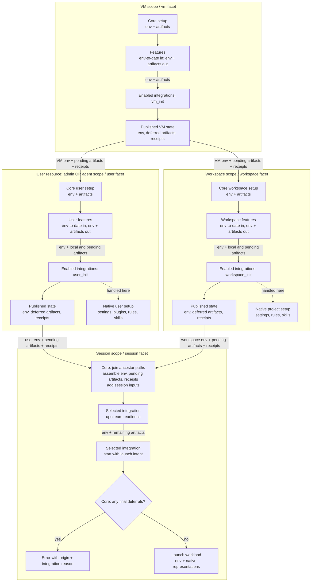

# Harness Scope Framework: High-Level Architecture

- Status: Proposed architecture for draft review; no merge or implementation intent yet
- Date: 2026-09-06
- Requirements: [FRD](frd.md), R1 through R16
- Saga: [next-steps](../2026-08-04-next-steps/target-state.md), wave 4
- Governing design: [scope participation](../2026-08-04-next-steps/scope-participation-contract.md)
  and [capability descriptors](../2026-08-04-next-steps/capability-descriptor-contract.md)
- Code baseline: `b22cc49c984aa91e8205e035c5766b5a2aede90a`

The [operator's artifact-delivery ruling](frd.md#operator-ruling-artifact-delivery-2026-09-06)
replaces the original all-payload session rollup with typed artifacts and integration-specific
deferral, retaining small setup hints alongside rules and skills. This draft carries the authorized
FRD amendment and its architecture response together; the saga lead owns reconciling the superseded
shared-contract wording.

## Architecture in one view

Each resource's existing lifecycle drives a small setup pipeline: core, ordered features, then
ordered harness integrations. Core supplies the resource identity, execution target, inherited env,
and artifacts. An integration receives the config for the facet being invoked and owns its harness's
representation and applied facts. Each invocation returns artifacts it defers; core delivers those
to later applicable invocations of the same integration. Sessions consume accumulated env and the
remaining artifact payloads, diagnose missing setup, and cannot launch with unresolved deferrals.
They do not run ancestor setup as a side effect of starting a workload.



Each setup arrow carries the env and artifact inputs through the integration invocation. A scope
publishes only after its pipeline succeeds; the boxes abbreviate the existing persistent store, not
new stores. Source contributions are retained for other integrations and input-revision checks,
while delivery uses each integration's deferred output. Native handling removes that payload from
later invocation inputs; it does not erase its source or applied receipts. If an integration is not
selected at a scope, core passes its applicable artifacts through unchanged.

The user and workspace branches are siblings. A session combines them by immutable origin and input
revision, so a VM item handled on the applicable user branch does not reappear from the workspace
branch. Env accumulates using its existing precedence and is supplied to every integration; it is
not subject to artifact deferral. The user box is invoked once per actual user: admin setup follows
VM setup within VM init, while agent setup has its own lifecycle. A session uses its bound user's
branch, never both admin and agent. Native configuration, shown at the side, remains at its defining
resource; it is not a deferred artifact or a config blob merged into session config.

The pipeline is shared orchestration code, not a registry of scopes or an extensible execution
engine. Resource managers retain activation, preflight, secret resolution, realization, error
framing, and rollback. Existing Python models, capability descriptors, transports, and SQLite
instance state remain the stack. There is no new runtime service or dependency. Feature and
integration setup use the full `Transport` after core makes it available; the native bootstrap
channel is only an `ExecTransport` and cannot be assumed to support file transfer.

## Where the current code changes

These anchors describe the baseline, not the proposed implementation's eventual line numbers.

| Existing seam                                                                 | Architectural change                                                                                                                                                          |
| ----------------------------------------------------------------------------- | ----------------------------------------------------------------------------------------------------------------------------------------------------------------------------- |
| `cli/agentworks/capabilities/harness_integration/base.py:202`                 | Separate common config binding from the session-only constructor, target guard, probe cache, and conversation state. Add setup invocation methods to this one registered API. |
| `cli/agentworks/capabilities/base.py:339` and `capabilities/config.py:517`    | Extend `config_for` and its cached model selection to preserve the facet in every downstream consumer.                                                                        |
| `cli/agentworks/capabilities/descriptor.py:159`                               | Replace the single hosted field assumption with the concrete hosting surfaces this effort introduces.                                                                         |
| `cli/agentworks/vms/initializer/driver.py:396` and `agents/initializer.py:31` | End each owning scope's core setup with features and integration setup; remove Claude-specific dispatch.                                                                      |
| `cli/agentworks/workspaces/realize.py:50`                                     | Run workspace participants inside the shared create body, before the workspace is declared complete.                                                                          |
| `cli/agentworks/env/entry.py:69` and `env/merge.py:19`                        | Reuse env declarations and the existing precedence ladder; incorporate producer contributions without persisting resolved secrets.                                            |
| `cli/agentworks/db/instance_state.py:37`                                      | Register closed keys and domain codecs for setup contributions and harness applied facts; retain the existing table.                                                          |
| `cli/agentworks/plugins/claude/harness_integration.py:129`                    | Own user plugin reconciliation, workspace materialization, session hoisting, and upstream diagnostics.                                                                        |

## Resource ownership and attachments

The five setup/runtime scopes and four capability facets remain distinct. `OperationScope` currently
describes the command's identity and also includes a system level. It is not the five-scope setup
model and must not become the facet selector. Core's consuming resource chooses the facet once. A
scope names the resource/lifecycle boundary; a facet pairs the API methods and config an integration
implements. An artifact originates at a scope, possibly emitted before any harness method runs. An
integration handles it through a facet invocation for a concrete resource. Admin and agent stay
distinct scopes and both use the user facet; deferral never changes the origin.

| Owning scope | Config and selection surface                                    | Facet and operation          | Persistent owner          |
| ------------ | --------------------------------------------------------------- | ---------------------------- | ------------------------- |
| VM           | `vm-template.harness_integrations`                              | vm, `vm_init`                | VM                        |
| Admin        | Selected `admin-template.harness_integrations` (proposal below) | user, `user_init`            | VM, admin setup component |
| Agent        | `agent-template.harness_integrations`                           | user, `user_init`            | Agent                     |
| Workspace    | `workspace-template.harness_integrations`                       | workspace, `workspace_init`  | Workspace                 |
| Session      | Existing `session-template.harness_integration`                 | session, `start(intent=...)` | Session                   |

**List membership explicitly enables an integration at that setup resource.** Broader attachments
are ordered lists of tagged capability config blocks. Each block has the existing `name`
discriminator and only that facet's fields. A name-only block enables the integration with defaults;
there is no separate `enabled` flag. Multiple entries enable multiple integrations, each bound to
its own config and executed in list order. Duplicate names in one effective list are a config error.
An empty effective list selects none; default config or an implemented method cannot attach
anything.

Session selection remains singular and explicit through `harness_integration: {name: ...}`. A
selection declared by the selected template or inherited from a parent counts as explicit. If the
effective selection is absent, report a config error rather than silently choosing shell. Preserve
ordinary default shell use by giving the code-synthesized `session-template/default` an explicit
`name: shell` block (`sessions/kinds.py:82`), not by substituting shell during resolution.

An attachment does not enable its plugin globally, select a session workload, or implicitly attach
the integration to an ancestor or descendant. Existing plugin enablement and graph miss policies
apply, including the existing capability-enabled gate. Plugin availability is distinct from resource
selection: making a plugin available never enables its facets on every resource. An ancestor
selecting a different integration or none does not consume its artifacts for this integration:
original contributions remain available to establish that integration's input. An integration's
deferred output never changes another integration's delivery.

**Admin attachment proposal, for confirmation:** place selection and user config together on the
already-selected admin-template, using the same list shape and user-facet schema as agent templates.
The VM already records `admin_template`, selects it with `--admin-template`, and supports an
independent `--admin-spec` overlay (`cli/agentworks/instance_specs.py:105`). This avoids a second
admin selection/config join on the vm-template. FRD open question 3 explicitly asks about a
vm-template spelling, so this is a proposed answer requiring confirmation, not a silent amendment.
If a separate VM attachment is required, settle its ownership before the plan and LLD.

This changes every silent session-template lineage, not only `default`. Remove the fallback in
`sessions/templates.py:276` and finalize validation at `sessions/template.py:125`; the standalone
dictionary resolver follows the same rule. Reference edges then reflect the explicit effective
selection, including the synthesized default. Config-only child templates still inherit their
parent's selection. Existing named templates with no effective selection need an explicit block or
an explicit parent selection before use.

For inheriting templates, the attachment list replaces as a whole when authored by a nearer layer;
omission inherits and an explicit empty list removes the inherited selection. Each block still uses
its model's defaults and validation. This makes effective execution order explicit without adding
list-item patching, dependency declarations, or integration priority knobs. The admin-template keeps
its existing non-inheriting behavior, and instance overlays follow the same field policy.

## Facet config is ordinary capability config

Keep `config_model` as the single-config declaration and `config` as the bound validated instance.
Extend `config_for(facet=None)` rather than adopting the old `config_at` sketch or shadowing the
bound `config` property. A single-config capability ignores the optional selector and remains
unchanged. `HarnessIntegration` supplies the session-only default mapping for existing integrations:
its `config_model` is the session answer and setup facets offer no config. A multi-facet integration
overrides `config_for` for the fixed vm, user, workspace, and session vocabulary. Calling a
multi-facet selection without the consumer's facet must not silently select session config.

No offered model means an attachment accepts its selection tag and no config fields. It still may
invoke a method. Offering a model is neither a support claim nor a permission to invoke anything.
Only the harness kind enumerates the four facet answers during registration/finalize; ordinary
capabilities do not acquire per-facet declaration tables or new obligations.

Core records each hosting field's selected facet alongside its existing capability-block metadata.
Admin and agent hosting fields both select user. Harness reference output groups all four facet
schemas, including an answer with no config; a reference to a particular resource field renders
exactly that field's answer. The frozen descriptor carries a sequence of hosting surfaces with
singular or list cardinality, replacing its current one-field assumption. That metadata describes
consumers; implementations never receive a consumer kind as their config selector.

The model selected and checked at registration remains the model used for validation, merge,
references, secret extraction, and schema output. Extend the current offered-model cache by facet;
retain the current declaration-sensitive cache identity so registration, declaration replacement,
and snapshot restoration cannot reuse a mismatched answer. Cache tagged unions by kind, selected
facet, and the actual selected model arms. Preserve effective-layer validation and provenance,
including errors pointing to the block and declaring resource.

The pre-design call-site walk identifies these obligations:

| Consumer                                                                              | Required behavior                                                                                                                                               |
| ------------------------------------------------------------------------------------- | --------------------------------------------------------------------------------------------------------------------------------------------------------------- |
| `capabilities/config.py`: structural references, construct validation, and model maps | Receive the hosting field's selector; choose one model per blob.                                                                                                |
| `capabilities/conformance.py`                                                         | Validate all harness answers at registration and retain the public `register_plugin` boundary checks for non-callable hooks, invalid models, and hook failures. |
| `capabilities/base.py` constructor                                                    | Bind config and extract secrets from the same cached selected model; do not make a second uncached hook call.                                                   |
| `manifests/field_tree.py` and `manifests/reference.py`                                | Render the correct facet at a resource field and all facets at the harness capability root.                                                                     |
| `manifests/spec_model.py`, `manifests/decode.py`, and schema walkers                  | Walk every attachment element with its index, facet, and owner; preserve tagged shape, shorthand policy, reference edges, and value-safe errors.                |
| Secret backend primary and mapping config                                             | Keep their ordinary config behavior and distinct `mapping_model` contract. They are not harness facets.                                                         |

The registries themselves are already typed. Narrow the heterogeneous descriptor accessor's class
type where needed and remove only wrappers made unnecessary by that change. `mapping_model` is a
separate contract, not residue to fold into this migration. Do not combine this work with unrelated
capability cleanup. The hook's public caller boundary remains real even while implementations are
first-party.

## First-party facet config and worked examples

These are the proposed facet assignments for all four shipped integrations. Existing session models
keep their fields, types, defaults, merge behavior, and launch semantics. Each block still carries
its integration's literal `name`; the hosting resource chooses the facet, so config never nests
under a `facets` key. "No fields" below means a name-only attachment, not a claim that the facet
cannot perform work. Claude Code and Codex now both have user and workspace setup config,
independent of their existing session settings. Shell's user and workspace facets need no config
fields to materialize artifacts; its VM facet retains the default deferral behavior.

| Integration name | VM config | User config                                                                                           | Workspace config                           | Session config fields beyond `name`                                                                                                                                                                                                                  |
| ---------------- | --------- | ----------------------------------------------------------------------------------------------------- | ------------------------------------------ | ---------------------------------------------------------------------------------------------------------------------------------------------------------------------------------------------------------------------------------------------------- |
| `claude-code`    | No fields | `marketplaces: list[str] = []`, `plugins: list[str] = []`, `settings: SettingsMapping or None = None` | `settings: SettingsMapping or None = None` | `permission_mode`, `model`, `reasoning_effort`, `goal`, `initial_prompt`, `agent`, `append_system_prompt`, `remote_control`, `vim_mode`, `terminal_bell`, `extra_args`                                                                               |
| `codex`          | No fields | `marketplaces: list[str] = []`, `plugins: list[str] = []`, `settings: SettingsMapping or None = None` | `settings: SettingsMapping or None = None` | `model`, `sandbox`, `approval_policy`, `profile`, `network`, `approvals_reviewer`, `reasoning_effort`, `goal`, `initial_prompt`, `agent`, `developer_instructions`, `vim_mode`, `writable_dirs`, `web_search`, `disable_strict_config`, `extra_args` |
| `grok-build`     | No fields | No fields                                                                                             | No fields                                  | `permission_mode`, `model`, `reasoning_effort`, `sandbox`, `goal`, `initial_prompt`, `agent`, `rules`, `extra_args`                                                                                                                                  |
| `shell`          | No fields | No fields                                                                                             | No fields                                  | `command`, `resume_command`, `required_commands`                                                                                                                                                                                                     |

Session defaults remain concrete: shell uses empty strings and an empty command list; the three AI
integrations default nullable options to `None`, boolean switches to `False`, and lists to `[]`.
Codex's `network` and `disable_strict_config` are nullable booleans; `web_search` remains
`bool | str | None`. Its `web_search: false` leaves the native setting alone, while `"disabled"`
explicitly disables search. Existing model definitions are the field-level contract:
`plugins/claude/harness_integration.py:53`, `plugins/codex/harness_integration.py:129`,
`plugins/grok/harness_integration.py:43`, and `capabilities/harness_integration/shell.py:53` under
`cli/agentworks/`. The LLD must carry these complete schemas into reference and validation fixtures,
preserving their defaults and their existing distinction between fresh and resumed launches.

Claude's existing marketplace/plugin configuration migrates to its user facet, renamed from
`claude_marketplaces`/`claude_plugins`. Codex user marketplace/plugin setup and settings mappings
for both are new in this effort. Workspace plugin installation remains follow-on work; it is not
inferred from the existence of a project settings file. Do not copy session knobs into user config
just because a harness can also store them in a native user file. CLI installation still uses the
existing `user_install_commands` surface. Codex's `profile` remains a session selection of native
config; it does not implicitly attach or run a user facet.

For example, these proposed manifests put Claude plugin setup on the user, artifact materialization
on the workspace, and workload policy on the session. The marketplace and plugin names are
illustrative operator-owned values; plugin enablement and the ordinary VM/workspace selection still
apply. These new setup attachment fields become valid when this effort implements them.

```yaml
apiVersion: agentworks/v1
kind: agent-template
metadata:
  name: team-claude
spec:
  user_install_commands: [claude, codex]
  harness_integrations:
    - name: claude-code
      marketplaces: [example-org/team-plugins]
      plugins: [reviewer@team-plugins]
    - name: codex
      marketplaces: [example-org/codex-plugins]
      plugins: [reviewer@codex-plugins]
      settings:
        source: file::~/.config/agentworks/codex-user.toml
        strategy: merge-preserve
    - name: shell
---
apiVersion: agentworks/v1
kind: workspace-template
metadata:
  name: team-project
spec:
  harness_integrations:
    - name: claude-code
      settings:
        source: file::~/.config/agentworks/claude-project.json
        strategy: merge-overwrite
    - name: codex
      settings:
        source: file::~/.config/agentworks/codex-project.toml
        strategy: skip-existing
    - name: shell
---
apiVersion: agentworks/v1
kind: session-template
metadata:
  name: team-review
spec:
  harness_integration:
    name: claude-code
    permission_mode: default
    initial_prompt: Review the pending changes.
```

Creating a user from `team-claude` installs both CLIs through core setup, runs user-features, then
invokes Claude and Codex user facets with their own marketplace/plugin lists and artifact inputs.
The name-only shell attachment materializes its filesystem representation. Codex also maps the
selected workstation file to its native user settings using the stated strategy. Creating a
workspace from `team-project` runs Claude, Codex, and shell workspace facets with separate config
and workspace artifact inputs. Claude maps its project settings file there; shell publishes its
workspace artifact files. A name-only attachment still explicitly enables default setup; it is
distinct from omitting the integration. A `team-review` session using those resources gets only
session config, applicable env, deferred artifacts, and upstream readiness facts; it does not
receive the user config as launch flags. The same user block is valid on the proposed admin-template
attachment surface. Putting `permission_mode` in the user block or `plugins` in the session block is
a facet-specific validation error. The user's Codex attachment does not implicitly attach Codex to
the workspace or select it for the session. With no inherited attachment, omitting the workspace
list selects none; an explicit empty list removes inherited selection. To use Codex for a session,
select `name: codex` in that session's singular block.

All four integrations retain ordinary session-only use when setup is not requested. These are
alternative `session-template.spec.harness_integration` blocks, each paired with its existing
CLI-installing agent template where needed:

```yaml
# With example-codex; existing session settings remain here.
name: codex
sandbox: read-only
approval_policy: on-request
---
# With example-grok; existing session settings remain here.
name: grok-build
permission_mode: default
---
# Explicit shell selection needs no plugin or setup attachment; defaults launch a login shell.
name: shell
```

Absent setup attachments do not by themselves prevent those sessions from launching. Each still
checks its required executable and any upstream prerequisite its integration declares. A name-only
attachment uses empty setup config where offered. Grok retains the no-op setup default; Codex gains
native config setup but is not required to implement the entire artifact vertical here. Shell
implements the filesystem representation described below, including delivery at session start when
no broader shell attachment handled the artifacts. A default shell can therefore launch with an
inherited hint after publishing it. Empty config or plugin provisioning alone does not establish
artifact handling for another integration. Nonempty final deferrals still fail before launch, and
publication errors fail normally with origin, producer, integration, and reason.

## Same config shape, separate native scopes

The integration may reuse config fields or a model across facets. Each attachment still binds a
different instance with its own origin, lifecycle, desired state, and applied receipts. Both Claude
Code and Codex have `settings` at user and workspace facets: the user mapping writes native user
settings, and the workspace mapping writes native project settings. Reusing that shape does not
merge the declarations. `marketplaces` and `plugins` are user-facet fields in this effort.

Template inheritance composes config for one owning resource; settings mapping merges into one
native file; the harness combines native user/project layers at launch. These are three separate
operations. Agentworks never copies user marketplaces, plugins, or settings into the workspace to
simulate inheritance. Native precedence and project trust remain the harness's responsibility. For
example, mapping a user's settings and a project's settings writes two different native files; when
they set the same native key, the harness decides which applies in that project. It does not cause
Agentworks to overwrite the user's file with project values.

**Workspace plugin installation is a follow-on, not an offered field.** Claude documents a project
association in `.claude/settings.json`, but also cases where each user must install the referenced
plugin before it loads. Codex provides marketplace/plugin commands and project TOML configuration;
the installed CLI's plugin-add help does not establish a project install path. Neither observation
alone proves user-independent workspace provisioning. This revision therefore offers no workspace
`marketplaces` or `plugins` field for either integration.

A follow-on must prove actual applicability with two users and two workspaces. If installation needs
a user identity but can remain restricted to that user in the originating workspace, deferring it to
the session could be valid. A global user install would still be wrong. That would also require a
native setup deferral contract, with origin, applicability, per-user completion, and native
association/cache ownership; it must not be smuggled into hint/rule/skill payloads. It is not needed
to deliver this effort. Repository-owned project settings, rules, and skills provide the immediate
project customization path; mapping settings alone makes no promise to install referenced plugins.

## Mapping workstation settings

`SettingsMapping` is a native setup config value, not a new agent artifact kind. Initially each
attachment maps one file to the integration's ordinary settings role for that facet. The integration
chooses the destination and native parser; no arbitrary guest destination or filesystem-sync engine
is added. The shape is `settings: {source: <source reference>, strategy: <policy>}`. Both fields are
required when `settings` is present; omission means no mapped settings.

Reuse the local-file spelling and path rules of `SourceRef` (`cli/agentworks/sources.py:41`),
accepting `file::` or an ordinary workstation path. This settings surface initially accepts local
files only; Git-backed settings acquisition is follow-on work. The shipped `fetch_file` writes to a
guest transport, and its Git branch clones on that guest; it is not a workstation validation helper.
Add a small shared workstation-file snapshot helper, then let the integration parse that captured
snapshot and use the existing transport to publish its resulting native document. Do not add a local
transport merely to fit the old helper's signature.

Acquire and validate the source before this integration's first native settings or plugin write;
core/feature setup earlier in the pipeline keeps its existing lifecycle. Workstation paths use the
invoking process's home and working directory, never the guest's. Keep the captured bytes stable for
the operation, using temporary local storage where transfer requires a path, and clean it up on
success or failure. Transfer the captured result rather than rereading a possibly changed source at
write time. This is a snapshot, not a symlink or mount. Reinit rereads the source; session start
uses applied state and native files and has no workstation-source dependency.

| Integration | User settings destination             | Workspace settings destination    | Parser             |
| ----------- | ------------------------------------- | --------------------------------- | ------------------ |
| Claude Code | That user's `~/.claude/settings.json` | Workspace `.claude/settings.json` | Native JSON object |
| Codex       | That user's `~/.codex/config.toml`    | Workspace `.codex/config.toml`    | Native TOML table  |

Paths denote native roles, respecting any supported home override in the actual invocation.
Authentication/session files are not settings roles. Sources must be non-secret settings; declared
secret references remain on the existing resolution path. Do not archive settings bytes or resolved
credentials in desired/applied state, errors, or logs. Native paths embedded in settings are copied
as values, not automatically rewritten from workstation to guest; portable source files are the
operator's input.

The four strategies govern collision with the live destination:

| Strategy          | Behavior                                                                                                 |
| ----------------- | -------------------------------------------------------------------------------------------------------- |
| `replace`         | Replace the complete settings document with the source, including removal of destination-only keys.      |
| `merge-overwrite` | Recursively merge objects/tables; source values win at colliding leaves. Preserve destination-only keys. |
| `merge-preserve`  | Recursively merge objects/tables; existing values win at colliding leaves. Add absent keys.              |
| `skip-existing`   | If any destination file exists, leave that whole file unchanged; otherwise create from the source.       |

Arrays are atomic values, not concatenated or merged by position. When only one side is an
object/table, that whole value is a collision and the strategy's winner applies. Duplicate keys in
any document that must be parsed are rejected rather than depending on parser last-write behavior.
The source must parse even for `skip-existing`; an existing destination need not parse when skipped
or completely replaced, but merge requires a valid native document. A directory or unsuitable link
at the destination is an error, not a file to replace. Missing source or parse/type failure occurs
before destination writes. Native output must remain valid; merge is semantic and makes no promise
to preserve formatting.

For example, with existing `{ui: {theme: dark}, extra: true}` and source
`{ui: {theme: light, bell: true}}`, replace removes `extra`; merge-overwrite changes the theme and
adds the bell; merge-preserve keeps the dark theme and adds the bell; skip-existing changes nothing.
Reapplying the same source and policy is idempotent. These policies act on current destination state
on each reinit, including operator edits; choosing overwrite or replace expressly permits that
behavior. It does not relax artifact ownership checks elsewhere.

One invocation plans its settings changes as a unit. Explicit `marketplaces`/`plugins` config and
the settings document produced by the selected strategy must not silently fight over native keys or
identities: inconsistent desired declarations are config errors before writes, while matching ones
are reconciled once. Source values discarded by `skip-existing` or `merge-preserve` are not proposed
writes and cannot create a conflict by themselves. Treat native plugin commands that also edit
settings as part of that same plan, with receipts for their actual writes. `skip-existing` skips the
file mapping, not the separately declared plugin work. The LLD must specify native command ordering
and protect mapped settings against subsequent plugin-command rewrites; attachment order is not a
last-writer policy.

Applied facts distinguish keys/files written by the mapping from untouched content. A skip or a
preserved collision grants no ownership of the retained value. On removal of a mapping, leave the
settings file and its current values in place and relinquish only this mapping's claims; there is no
automatic restoration of overwritten workstation-independent values or deletion of an adopted file.
Report that settings are retained. Explicit removal of managed plugin associations remains separate
and may change their native keys. This is deliberately a provisioning policy, not a backup system.
Changing the source or strategy reruns the mapping at the next owning setup operation, subject to
other recorded owners and native validation. Workspace mappings retain the create-only lifecycle;
subsequent changes require workspace recreation until an owner-authorized reinit surface exists.

## Invocation API and execution

Retain `vm_init`, `user_init`, and `workspace_init` as the method names. Each receives a typed
invocation for its facet and reports applied facts through a manager-owned checkpoint channel; the
base defaults perform no work, report no applied facts, and return every input artifact as deferred.
Setup results carry the deferred collection and an integration-authored reason for each item.
`start` retains `HarnessLaunchIntent` and the current launch-result alternatives; its successful
result adds the same deferred collection alongside the proposed launch command. Core checks it
before launching the workload. Ordinary execution failures and unsupported launch intents retain
their existing error/result paths, distinct from artifact deferral. The contract version increments
from 3 across the descriptor and all four first-party integrations. `start` remains the required
operation; the inherited setup defaults satisfy R3 without a supported scope registry. The optional
session cleanup operation described below also has a base default and stays outside the required
operation set. Existing session probe obligations remain on the session path.

Construct an integration binding for one owning resource and facet. A present attachment supplies
its effective config and contributions; an absent attachment supplies prior ownership for retirement
without validating absent config or inventing defaults. Both use the same facet method. Give setup
methods only the invocation that belongs to that resource: VM identity and system runner for vm;
username, home, and user runner for user; workspace identity, root, and setup runner for workspace.
Each also receives artifacts, previous applied facts for this integration, an applied-fact
checkpoint channel, and an env view carried by the runner. Core binds the user invocation to its
user. Origin metadata is descriptive provenance, not another dispatch mechanism.

Session construction adds session identity, workspace, workload target, launch readiness cache, and
conversation state. None of those fields is required to construct setup bindings. Conversely, a
session binding is never lent to a setup operation. The existing readiness identity checks remain
session-specific; setup readiness is attached to the owning graph node and lifecycle.

Run targets are lightweight views over existing transports with the invocation's env already bound.
They delegate file operations and execution rather than adding another transport implementation.
Per-call env can add command-specific values, while core identity variables remain authoritative.
This is delivery and convenience, not a sandbox: trusted integration code can access the underlying
system, and review enforces scope discipline.

VM initialization completes the VM pipeline before driving the admin pipeline. Agent initialization
runs independently on its VM. Workspace creation is VM-owned and does not choose an agent identity.
Existing orchestration orders prerequisites when session creation also creates resources; only those
explicitly requested creations may run setup. Starting an existing session never does so.

Features use the existing descriptor/registration pattern as the three core-owned kinds
`vm-feature`, `user-feature`, and `workspace-feature`. They have one config and one idempotent setup
operation, return env/artifact contributions, and are selected in a `features` list with the same
ordering and replacement rules as attachments. User-features run in the user setup pipeline; the
invocation context identifies the user. Concrete test implementations registered as vm-feature,
user-feature (covering both user scopes), and workspace-feature exercise every lane through the real
CLI in the vertical acceptance run, proving env and artifact delivery. There is no session-feature.

## The two currencies

**Env uses the shipped `EnvEntry` shape:** a plaintext value or a declared secret reference. Core
and feature outputs are ordered maps of those entries with producer provenance. Later producers
replace earlier values within a scope. Reuse the shipped cross-scope precedence:
`vm < workspace < (admin or agent) < session`; admin and agent never merge together. Pipeline order
within one scope does not change that precedence. Core-protected identity variables win last.

A user setup sees VM plus that user's env. Workspace setup sees VM plus workspace env, never an
arbitrary user's env. A session combines VM, workspace, its actual user, and session contributions.
Env precedence is not an artifact placement ladder. Artifact routing follows the actual resource
relationships: VM to user or workspace, then those applicable ancestors to session. Agent and
workspace are siblings, not ancestors of one another. Each invocation receives local artifacts plus
applicable inherited items still deferred for its integration, preserving their individual origins.

Template env becomes pipeline input alongside core-produced values. Existing bootstrap and core
install commands retain their hermetic runners. The new feature and integration lanes receive the
explicit env-to-date runner; this is the intentional extension beyond today's runtime-only env
injection. Their secret needs join the owning operation's existing preflight and resolution
boundary. A feature declares all secret references it may emit through its config before execution.
Its output may use that declared set but cannot introduce a secret lookup after the boundary
resolves. Runtime values exist only in the operation's runner and scoped secret view.

**Agent artifacts have three concrete kinds: hint, rule, and skill.** Hints describe Agentworks
setup as advisory context; a producer needing stronger guidance can emit a rule or skill. The term
distinguishes this small artifact from broader harness instructions or an initial prompt. Hints
still require handling or explicit deferral like every other kind. Rules and skills follow a reduced
Rulesync model. Shell preserves those contents and metadata in its explicit filesystem interface; AI
integrations preserve their native discovery and invocation behavior. None is a target filename:

| Kind  | Content and behavior preserved through delivery                                                                                                                                                                                                           |
| ----- | --------------------------------------------------------------------------------------------------------------------------------------------------------------------------------------------------------------------------------------------------------- |
| Hint  | A producer-local name and short, non-secret setup fact, such as an available env variable or successful tool authentication. It carries no separate rule applicability or skill invocation metadata.                                                      |
| Rule  | A producer-local name, instructional text, and applicability: always applying or matching declared workspace-relative paths. The integration preserves that applicability when representing the rule.                                                     |
| Skill | A producer-local name, discovery description, instructions, and a bundle of supporting files addressed relative to the skill root. Preserve the package and its discovery/invocation semantics; appending its instructions to a prompt is not equivalent. |

Core attaches immutable origin metadata: owning scope, resource identity, and producer (core or the
named feature). Together with the producer-local name, these identify an item across delivery;
duplicate names within a producer are errors. A facet is not an independent origin field: core's
fixed mapping derives the corresponding facet from the origin scope. The enclosing invocation or
persisted result identifies the current facet and resource; each returned item adds only its reason
to its original identity. No per-item attempt history is stored.

The name and origin form a pipeline source address, not wave 6's global artifact identity. Content
and applicability remain distinct from identity and from native destination. Skill members preserve
relative paths and non-secret contents so references and scripts travel with their instructions;
source paths are not destinations or permission to copy arbitrary host files. Package ingestion
validates relative paths and refuses escapes. The LLD settles the concrete bundle carrier and codec.

Core and features may emit these typed artifacts alongside env. An env declaration may be
accompanied by a hint describing the variable; a successful user authentication feature may emit a
hint that its tool is available. Descriptions contain no secret value. A claim about completed setup
is emitted only after that setup succeeds. Their producer API does not depend on a manually authored
template-artifact field, so that operator surface can follow immediately without changing delivery.
It is not required in this effort. Session inputs may likewise come from core; this does not add a
session-feature or change the shipped workload config knobs.

Limited hooks can later join as a distinct kind carrying explicit event and execution semantics. MCP
server configurations are another future kind, preserving structured connection/configuration
semantics through the same delivery contract. Their schema and provisioning are follow-on work. Do
not flatten kinds into arbitrary text or executable strings, erase provenance, or turn a skill into
a rule as a fallback. Global identity, attributed composition, hook execution, an artifact registry,
and distillation remain wave 6 work. Simple hint grouping is native rendering, not that future
composition system. All three kinds get concrete shapes now and are proven by the vertical.

A resource publishes successful core/feature contributions and each invoked integration's deferred
output to the instance-state store. Later operations reconstruct inputs without rerunning ancestor
setup. Persist env declarations and non-secret artifact content, including skill members, in the
versioned domain payload. An output schema has no resolved-secret arm. Integrations must not copy
secret values into artifact content, logs, hashes, reasons, or state. Trusted-code review and
negative runtime tests enforce that conduct; schema shape alone cannot. Secret env references
resolve afresh at the consuming operation boundary.

## Representation, ordering, and conflicts

Integrations run after core and every feature that emits env or artifacts. Features consume
env-to-date in template declaration order. Each integration receives the completed local outputs,
all applicable env, and its own inherited deferred artifacts. Integrations run in attachment order
but do not feed one another. A failed integration stops setup; deferral is an ordinary successful
setup result, not an error until the final session facet. Ordering never makes the last integration
the winner of a destination collision.

**Native placement at the defining scope is the ordinary case.** The integration decides what its
harness can represent at each invocation. A user-facet invocation normally installs a user skill
under that user's native skill directory. Hints may be grouped into one native rule for an owning
resource/facet invocation or deferred to a launch prompt. Grouping retains each contributing item's
origin and applies or defers those original items, not a replacement artifact with a new origin. An
item omitted from the successful deferred output is handled for that integration and applicable
resource path; later invocations need no payload copy. Handling for Claude neither handles it for
Codex nor handles it for another user.

Setup results return only the items left deferred, preserving the original artifacts and attaching
specific reasons. The no-op default defers every item. There is no separate handled-item result or
per-artifact acknowledgment ledger. Applied-state receipts still describe actual managed writes for
ownership, convergence, and readiness; they are not the delivery mechanism.

Core assembles pending payloads using contribution snapshots and successful deferred outputs for the
same input revisions. An absent integration provides no handling evidence, so that path passes
artifacts unchanged. A failed invocation or unknown/stale snapshot cannot imply handling through
absence. At a session, combine the workspace branch and the selected user's branch by originating
item, not text equality. A VM-origin item handled by an applicable user invocation must not reappear
merely because the workspace branch deferred it. Absence means handled only where that same item
revision was in a completed invocation's input. Source snapshots and deferred outputs establish
this; an additional acknowledgment table is unnecessary. Each integration chooses a consistent
materialization facet for an inherited item from its kind, origin, and applicability. Sibling setup
does not race to handle whatever appears unclaimed: the integration's other facet defers that item,
without consulting sibling state or adding core coordination.

**Core enforces final completion.** A successful session-facet result carries the same deferred
collection as a setup result. Any remaining entry becomes a typed core error before launching the
workload. The error identifies the artifact and immutable origin, the current session invocation,
and the integration's own reason. This preserves harness-specific explanations while putting the
terminal check in one place. Core enforces the returned contract; integration code and tests remain
responsible for actually applying everything it omits. Execution errors still raise normally.

A harness may use a workload-specific input or a privately referenced package to handle a deferred
artifact at the session facet, if that preserves the artifact's semantics. It must not place
session-only content in a user or workspace auto-discovery directory shared with other sessions. If
the harness has no suitable session mechanism, it defers with a reason and core refuses launch.
Session-specific files use the actual user's `~/.agentworks-artifacts/session/<session_name>/` with
integration-owned contents; placement there alone does not satisfy native discovery. Shell provides
the explicit filesystem interface below. Plain hints may be delivered through the launch prompt;
that is not a universal fallback for rules or skills with additional semantics. Already handled
payloads stay upstream; their applied receipts remain available to session readiness for
prerequisite and drift checks.

For every materialization, claim the smallest practical ownership unit: a rule file, a managed
member, or the files of a skill package, never an entire repository configuration directory. Inspect
the live destination against recorded ownership and hashes before changing it. For artifacts,
unclaimed existing content is a conflict even when bytes match; changed owned content is drift.
Neither is silently adopted, overwritten, or deleted. Explicit native settings mappings instead
follow their selected policy, whose bounded overwrite permission is R15; they still cannot take
another integration's recorded claim. Report resource, integration, and destination without content.
Core can report conflicting recorded claims across integrations; integrations still inspect actual
destinations because state can be stale. There is no cross-integration merge policy or claim that
these checks constrain arbitrary trusted in-process side effects.

## Shell filesystem representation

Shell implements R16 as a filesystem interface for explicit workload consumption. It publishes
readable hints, rule text with applicability metadata, and complete skill directories retaining
descriptions, instructions, and supporting-file paths. An index makes those artifacts discoverable
and preserves their original source addresses. Shell does not source rules, execute skill scripts,
or claim automatic AI-style selection. AI integrations still need their own faithful native
representations; this is shell's concrete contract, not a generic fallback that makes any file dump
count as delivery.

| Invocation | Shell placement and routing                                                                                                                         |
| ---------- | --------------------------------------------------------------------------------------------------------------------------------------------------- |
| VM         | Defer all artifacts; no VM-wide shell artifact installation is needed.                                                                              |
| User       | Publish local user and suitable inherited VM artifacts under `~/.agentworks-artifacts/user/` in that actual user's home.                            |
| Workspace  | Publish workspace-origin artifacts under `<workspace>/.agentworks-artifacts/`; defer VM-origin artifacts to the user branch or session.             |
| Session    | Publish remaining inherited and session-origin artifacts under `~/.agentworks-artifacts/session/<session_name>/` in the actual session user's home. |

This fixed routing avoids competing sibling placement. User and workspace attachment membership
remains explicit, even with name-only config. Without those attachments, complete ancestor
contribution snapshots still reach the selected shell's session facet for delivery. Session
materialization retains each artifact's original origin; it does not relabel inherited material as
session-origin or run missing ancestor setup. A stale or failed upstream snapshot still blocks
dependent delivery under the existing readiness rules.

The session index combines references to this invocation's published files with the applicable
upstream locations already recorded for shell. Obtain those references from the bound resource's
applied facts, not by scanning other users, workspaces, or session directories. Already handled
payloads stay upstream. When artifacts are available, shell's launch command exposes the index path
as `AGENTWORKS_ARTIFACTS`, through a shell-owned wrapper using existing command composition and
quoting. The workload can inspect the index and open the named files. Shell must set the current
index path when artifacts exist and explicitly clear the variable when none remain, reconciling its
previously owned index and files. Configured `AGENTWORKS_*` values currently receive an advisory but
are not all filtered (`manifests/decode.py:291`, `env/compose.py:92`), so omission would leave a
stale value intact. The wrapper must preserve default login-shell, custom-command, and resume
behavior, including the currently empty-command case. This wrapper behavior is new; it is not a new
core artifact currency or an arbitrary integration-env result. A shell with no applicable artifacts
needs no artifact directory.

Resolve the home through the actual workload-user target, not the workstation's home or a guessed
`/home/<name>`. Existing target-side `$HOME` expansion is a usable seam; session contexts do not yet
provide a discovered home field. Home-based roots and session directories restrict access to the
owning user. Workspace-origin files follow the workspace's intended access policy. A session path is
outside shared workspace and harness auto-discovery, but it is not secret from another session
running as the same user. Validate names and package paths as contained relative components; refuse
symlink escapes, unsafe roots, and unowned or modified destinations under the ordinary artifact
ownership rules. A session index lists only that session's applicable artifacts.

Shell's workspace directory is generated runtime material, not repository content to commit. In a
Git workspace, establish and verify effective exclusion of `/.agentworks-artifacts/` before
publishing files. Use Git's repository-local exclude path, resolved through Git rather than assuming
`.git` is a directory, and manage only an attributed fragment there. Preserve existing patterns; do
not edit tracked `.gitignore`, user-global excludes, or already tracked content. The
[Git ignore rules](https://git-scm.com/docs/gitignore) distinguish these local exclusions from
version-controlled patterns and do not untrack files that are already in the index. A tracked or
unowned artifact root remains an ownership conflict.

Exclusion management is new integration work. Record the owned fragment through instance state and
remove only that unchanged fragment when its generated output is safely retired. Check the actual
effect of the exclusion; a repository rule can override a local pattern. If the needed metadata is
not writable inside the owning workspace, the exclusion cannot be made effective without changing
repository policy, or safe publication otherwise requires wider mutation, defer before creating
artifact files. The session facet can deliver those workspace-origin items in its home-based
directory. In particular, a linked worktree can resolve its exclude file outside the workspace into
shared Git metadata; workspace setup must not mutate it and rely on workspace rollback to undo the
change. A non-Git workspace needs no exclusion.

The directory's session name is a locator, not proof of ownership. Use core's `session_uuid` from
the
[governing identity contract](../2026-08-04-next-steps/scope-participation-contract.md#session-and-run-identity)
to bind session-scoped integration state and artifact receipts, together with concrete
VM/user/workspace placement. That UUID is minted once at session creation, immutable, never reused,
and retained across start/restart/resume. The contract's `run_id` identifies each workload
incarnation and is not the owner of these surviving files. A fresh session under the same human name
receives a different UUID and cannot adopt or delete residue without its matching claim.

Shipped `SessionRow` has no UUID (`db/models.py:149`), so R16 consumes the contract's permitted
early identity slice: persist `session_uuid`, assign existing rows one UUID in a migration that does
not assign another on retry, and expose it through core's session invocation context before artifact
writes. Session-scoped integration state and receipts use this UUID as their identity; update the
existing instance-state bindings/codecs rather than add another store. Human names remain
lookup/display keys and cannot alone authorize mutation. The LLD must specify durable identity
publication and state association, including partial-create recovery, before the shell
implementation. This effort owns that prerequisite slice, coordinated with sibling consumers through
the saga so there is one shared schema introduction; per-workload `run_id`, events, and observation
remain wave 5 work.

Stop retains files for the same session's later start. Start/restart reconciles session-owned files
and its index against current inputs, using prior claims and hashes; it does not repair upstream
files or copy already handled payloads. Publication or discovery failure blocks launch, and any
remaining deferral still goes through R7's core error. Partial failure keeps recovery evidence and
never claims an incomplete package as handled.

Deletion needs new integration cleanup wiring: the current harness API has no cleanup hook and
database deletion erases session applied state (`db/database.py:929`). Add an optional session-facet
cleanup operation (base default no-op) and invoke the recorded owner integration after workload
teardown, before removing the session's receipts or its user. Shell removes only its unchanged,
owned files and index; it may remove the session directory only when empty. Single-session deletion,
agent/workspace cascades, and partial session-create rollback must use this path while the
destination survives. The existing `_teardown_session` also serves stop and restart
(`sessions/manager/_lifecycle.py:190`); those operations are not deletion and must not invoke
artifact cleanup. Failed cleanup reports residue and retains the ownership evidence for retry; it
cannot be reported as completed deletion. The LLD must cover those callers and interrupted cleanup,
including resource removal that itself destroys the destination. No recursive deletion of a
same-name directory is authorized merely by its name.

## Applied state and convergence

Use the existing instance-state store, with closed keys for scope contributions and harness applied
state. The VM payload separates VM setup from admin setup; agent, workspace, and session owners use
their own rows. Inside each harness payload, integration names separate versioned records. The store
schema needs no new table and no key per integration. Conversation state remains in its existing
session namespace; an artifact record does not replace a harness conversation ID. This existing
instance-state facility is the basis for idempotent cleanup as well as setup. Desired config and
producer outputs describe what is wanted now; the applied slices describe what this integration
actually provisioned and may retire. Cleanup is not inferred from filenames, current config alone,
or the absence of an artifact from a deferred result. There is no second cleanup database.

For artifacts, plugins, marketplace registrations, and other native setup resources, retain the
non-secret identifiers, ownership, and removal facts needed after their original declaration is
gone. The integration performs safe native removal where supported, checks whether the resource is
already absent, and checkpoints each completed removal through the same instance-state path. A retry
converges without repeating destructive work or forgetting another integration's claims. A removed
feature's artifacts and a removed individual plugin use this reconciliation just as a removed whole
attachment does. Resource deletion consumes applicable cleanup records before discarding them when
provisioned effects would otherwise survive that deletion.

Cleanup follows each owning lifecycle; this does not add workspace reinit. It need not reverse every
effect. Settings mappings retain their document under R15's explicit policy. For other native
resources, an unavailable removal mechanism, ambiguous ownership, drift, or failed removal must
identify what remains and retain evidence needed for retry or operator disposition. Intentionally
retained output is distinguished from pending cleanup; neither is reported as successful removal.
The integration owns these native decisions and core owns persistence and lifecycle dispatch.

Persist each integration's successful deferred collection together with its input revision
references and the scope's published contributions. This identifies which outputs can still be used
for delivery after config changes or reinit; it is not a historical record of every attempt.
Preserve source content needed by another integration and earlier applied receipts needed for
cleanup. Before the first setup mutation, invalidate the prior completed delivery snapshot while
retaining its content and receipts for reconciliation. A failed reinit cannot leave that old
completion eligible, even when input revisions have not changed. Publish a new completed snapshot
only after success. An invalidated or incomplete snapshot cannot supply delivery evidence. If
artifact routing depends on that snapshot, session readiness reports an upstream setup-state failure
and the owning recovery operation instead of treating it as an empty deferred result or
manufacturing new deferrals that might duplicate partly applied content. When complete producer
records independently establish that there are no applicable artifact inputs, no residual delivery
result is needed; a config-only setup gap follows its declared readiness severity. A failed
recommended config-only setup can therefore warn and permit launch. An invalid snapshot itself is
never evidence of empty inputs.

An applied record carries its payload version, contributing source locators, destination or native
resource, representation strategy, non-secret content hash where meaningful, and confirmed outcome.
The owning manager persists facts from completed work, using partial slice replacement so another
scope, another integration, and unknown future keys survive. Successful feature/core contributions
and the evidence describing their application must describe the same setup generation. Readiness
must not combine fresh desired config with stale receipts and call that applied success.

Reinit recomputes desired output and reconciles it with the prior record and live destination.
Settings mappings use their explicit collision and retain-on-removal policy; the following removal
rules govern managed artifacts and plugin resources. It writes changed owned content, leaves
matching content alone, and removes obsolete owned units only when their ownership and recorded
content still match. Removed attachments must also be reconciled: the manager retains their records
and invokes the same facet method with an absent-attachment desired state before dropping confirmed
removals. This means no desired integration-owned resources, including config-driven plugins and
marketplaces, not merely an empty artifact list. Prior applied facts retain the non-secret
identifiers needed to undo owned work independently of current config. If its plugin is unavailable,
report pending cleanup and retain evidence; never erase the record and pretend cleanup happened.

Each completed mutation checkpoints its applied facts before the next mutation. The manager owns
persistence and acknowledges the checkpoint only after it succeeds; persistence failure stops
further writes. Thus a later exception preserves the successfully recorded prefix, without requiring
a successful method return to recover it. Contributions and deferred outputs become the published
scope snapshot only on successful scope completion; partial integration receipts remain
distinguishable from that completed snapshot. For a new workspace, the checkpoint channel buffers
facts until the creation commit, because its failed partial work is unwound as described below.

Remote writes and SQLite are not a distributed transaction. A process can die after a remote change
and before recording it. Treat any unexplained residue on retry as unowned until the integration can
prove the original claim from durable evidence. Do not silently adopt matching bytes. Unknown future
payload versions remain uninterpreted evidence; malformed known records yield safe diagnostics and
no trusted ownership. Neither grants permission to overwrite. Domain codecs migrate recognized old
versions; partial replacement preserves unknown well-formed store keys as required by the saga
ruling.

Serialize mutation for the same owning resource across command executions, covering observation,
remote changes, and receipt persistence. Reuse this owning-resource lock for session artifact
publication through workload launch, and for deletion from workload teardown through cleanup and
receipt removal. Acquire it before reading ownership evidence; hold it until that operation's result
is committed. Start, restart, stop, and deletion, including cascade callers, must participate so
deletion cannot erase receipts while a competing launch publishes files. The session-name lock also
excludes recreation until prior deletion finishes; the UUID-bound claim still protects against stale
residue after that lock is released.

This is one serialization contract for the owning resource, not a second session lock service. A
competing operation refuses with the owning resource and retry guidance instead of queueing. The LLD
must choose a lock with that actual cross-process lifetime and specify cascade acquisition; a SQLite
write transaction held across network calls is not the design.

## Workspace retry and session readiness

Workspace setup participates in `realize_workspace`, shared by standalone create and
`session create --new-workspace`. Run features and integrations after the directory and repository
exist but before publishing successful creation. Commit the workspace row, desired overlay,
contributions, deferred outputs, and initial applied facts together only after setup succeeds.

On a handled failure before that commit, unwind the newly created workspace directory, group, and
local stub using the existing partial-create path. A retry is another `workspace create` with the
same inputs after successful cleanup. A cleanup failure or process crash reports residue and refuses
to adopt a pre-existing path on retry; the operator inspects and removes or relocates it before a
fresh create. This deliberately avoids adding a workspace reinit command or a durable partial-create
state machine. Once creation commits, later session failure follows the existing orchestrator's
completed-resource retention or teardown policy. No integration may write outside the new workspace
as part of workspace setup and expect that rollback to cover it.

**Required and recommended facets are prerequisites of the consuming invocation.** The session
integration declares them through its readiness check, using its selected config and the actual
session resource bindings. This is not a global required/optional flag on a facet schema, nor an
inference from an override's presence. Core supplies applicable ancestor records, including the
user-facet record for this integration and the session's actual user, plus owner remediation
references. A successful admin setup or another agent's setup cannot satisfy this user's
prerequisite.

Add an upstream-prerequisite check at the existing session readiness boundary, alongside the
existing command/target probes. Its default returns no gaps, preserving session-only integrations.
The integration receives the applicable setup facts and may perform inexpensive probes; it returns
typed gaps containing the needed facet, core-supplied owner reference, reason, and severity
(`required` or `recommended`). This result and warning path are new: shipped harness probes return
nothing on success and raise on failure. They are not a static facet-support or dependency graph.
Keep the existing pending-target/preflight deferral: when this operation explicitly creates the
user, assess its setup after the prerequisite nodes run, before launch. The check is read-only and
must not turn a session start into an implicit user initialization. Readiness caching remains bound
to the same session operation and evaluated setup generation.

The check names the needed condition and evaluates completed applied state and inexpensive probes. A
selected attachment or the existence of `user_init` alone is not proof of completed setup. Missing,
incomplete, stale, or failed setup cannot satisfy a prerequisite for successful current setup.

| Session readiness policy           | User-facet state for the session's user            | Result                                                                                                          |
| ---------------------------------- | -------------------------------------------------- | --------------------------------------------------------------------------------------------------------------- |
| Required user setup                | Missing or not successfully current                | Block launch; identify this integration/user and the owning setup or reinit operation.                          |
| Recommended user setup             | Missing or not successfully current                | Warn with the same owner-specific remediation; permit launch if other prerequisites and artifact delivery pass. |
| No user setup prerequisite         | Absent                                             | Permit launch without a user-setup warning if other prerequisites and artifact delivery pass.                   |
| Required or recommended user setup | Successfully current, with required probes passing | The prerequisite is satisfied.                                                                                  |

For example, an integration that needs a profile generated by its user facet reports a required gap
when that profile/setup is absent for the session's user. An integration that merely benefits from
its user defaults reports a recommended gap and can launch without them. These illustrate policies
an integration can implement; they do not add a generic template `required_facets` switch. Core
frames required gaps as typed errors and recommended gaps as warnings, preserving the integration's
reason and the owning remediation. Session operations never execute the missing setup automatically.

Missing optional broader attachments are not automatically required: a session-only integration with
no artifact inputs keeps working. No supported-scopes report is introduced; schema output describes
config, and doctor reports actual readiness rather than inferring support from overrides or model
presence.

For VM/admin and agent drift, remediation points to VM or agent reinit respectively. For workspace
materialization problems, report the specific path and create-only lifecycle, with inspection and
explicit recreation guidance. Do not imply `workspace repair` reruns this pipeline. Successfully
handled upstream artifacts are not silently reclassified as deferred after drift. Readiness reports
that missing prerequisite through the owning operation. A deferred artifact may be handled at the
session facet only if that preserves its semantics and workload applicability; it cannot quietly
repair a required upstream gap. Final nonempty deferral is always a launch error, independent of the
required/recommended classification of other readiness prerequisites.

## Claude vertical slice and migration

Claude Code proves the design end to end. Its user facet owns `marketplaces` and `plugins`, migrated
from core's `claude_marketplaces` and `claude_plugins`. Its reconciliation compares native installed
state and prior ownership, handles removals only for resources it owns, and uses the same user
method for admin and agents. Core invokes an integration; it contains no Claude-specific field,
import, installer branch, or default selection.

Its workspace facet owns project settings, separate from user settings. Codex adds user
marketplace/plugin setup and user/workspace settings mappings with its own native format. Workspace
plugin installation for either integration is follow-on work under R14's applicability boundary.
Both settings mappings exercise replacement, overwrite-merge, preserve-merge, and skip-existing
policies using non-secret workstation fixtures.

Its user and workspace facets group setup hints into owned rules where suitable and materialize
declared rules and complete skill packages at native user and project destinations, subject to
ownership checks. Claude documents rules under `.claude/rules/` and skills under `.claude/skills/`
at those levels. A user skill successfully handled by `user_init` is absent from subsequent session
payloads; session readiness can still check its installation. Hints deferred to the session can join
the launch prompt without losing their original attribution. The integration records every source
contributing to a grouped rule, so reinit can remove or update one hint without retaining stale text
or claiming unrelated content.

For inherited VM-origin artifacts, Claude's user facet owns any suitable native user placement; its
workspace facet passes them onward and materializes workspace-origin artifacts only. This choice
holds whether user or workspace setup runs first. Items without a faithful user representation
remain deferred for the session facet. The session facet must preserve rule applicability and skill
package behavior when using any session-specific mechanism; otherwise it returns a reason and core
refuses launch. Existing `append_system_prompt` remains supported, but it is not a general
substitute for a rule or a skill. The integration owns how setup hints and any compatible session
rule representation combine with that explicit config.

Rulesync informs the rule/skill model and separation of sources from generated destinations; it is
not invoked at runtime. Exact file names, package delivery, available session mechanisms, and native
plugin ownership probes belong in the LLD and must be verified against the actual CLI. The vertical
acceptance includes grouped hints, native user and workspace rules/skills, downstream filtering,
unchanged skill support files, and terminal refusal for an unrepresentable artifact. These are
integration details, not core special cases.

Update first-party manifests and upgrade guidance in the implementation change. Retire old template
fields and the two core install call sites together; do not leave two active configuration paths.
Old declarative input receives normal unknown-field framing with actionable migration guidance.
Persisted desired overlays that use the old fields require an explicit codec migration into the user
attachment, preserving existing values and rejecting ambiguous old/new combinations. Existing native
installations are inspected, not automatically claimed as owned just because old config mentioned
them. The migration strategy must explain how an operator deliberately establishes ownership or
removes conflicting old material before reconciliation can manage it.

Explicit session selection also needs migration guidance. A session row stores its template name;
its explicit instance overlay lives separately in instance-state. Neither snapshots the resolved
integration. Sessions using the synthesized `default` pick up its explicit shell block. Sessions
using custom silent lineages need an explicit selection in their template or inherited parent before
start/restart. There is no in-place session-overlay replacement operation; an instance-specific
change requires explicit recreation with `session create --spec`, not an invented start/restart
option. Report the missing selection and these supported remedies. Integration state namespaces are
not authoritative selection and must not be used to guess one. The LLD must cover finalize/reference
output, dictionary resolution, and existing-session restart in this sweep.

This review PR contains the FRD amendment and HLA. It contains no plan, LLD, permanent behavior
docs, or migration file. The next artifacts must specify the storage/locking and interruption
protocol, schema-host walk, user plugin ownership for both harnesses, settings-file parsing and
reconciliation, the early session UUID persistence/context slice, shell index/ownership and session
cleanup wiring, and config/overlay migration before implementation begins. Their acceptance must
include copy, rehome, delete, and state restore handling so owner records cannot bless artifacts at
a different destination or survive deletion and recreation under the same name.

## Validation and requirement coverage

Implementation evidence must include these observable cases, through the real CLI and a live backend
where setup changes the guest:

| Requirement    | Acceptance evidence                                                                                                                                                                                                                                                                 |
| -------------- | ----------------------------------------------------------------------------------------------------------------------------------------------------------------------------------------------------------------------------------------------------------------------------------- |
| R1, R2, R6     | Feature fixtures for all three kinds receive env-to-date and emit env, hints, rules, and skills; integrations run after all producers; VM, admin, agent, and workspace ordering is observed.                                                                                        |
| R3, R4, R5, R8 | A session-only integration remains compatible; different facet schemas validate on the proper resource, invalid public plugin hooks fail at registration, and setup never carries session identity/cache/state.                                                                     |
| R7, R12        | Hints, rules, and skill bundles retain semantics and origin through grouping and delivery; handled payloads do not reach session, deferral is integration-specific across both ancestor branches and creation orders, and any final deferral blocks launch with its reason.         |
| R9             | Repeated VM/admin and agent setup is unchanged; desired changes/removals converge; edited/unowned files cause drift/conflict reports; failed same-input reinit invalidates completion; interrupted work, unknown versions, and concurrent reinit do not overwrite or lose evidence. |
| R10            | Required, recommended, and absent user-facet prerequisites block, warn, or proceed respectively for the bound user; another user's setup cannot satisfy them; missing/stale/failed setup, correct owner remediation, and no upstream mutation are covered.                          |
| R11, R13       | Fresh and existing Claude admin/agent config migrates; marketplace/plugin changes reconcile; core has no Claude-specific knowledge (shell remains explicitly selectable); workspace create materializes real content, failure cleans partial output, and retry succeeds.            |

R14/R15 acceptance proves user marketplace/plugin setup for both Claude Code and Codex, config
reused at distinct facets without cross-resource merging, and rejection of unoffered workspace
plugin fields. Local fixture marketplaces avoid external services. It proves settings transfer from
the invoking workstation, all four policies with present/absent files, nested tables/objects and
atomic arrays, invalid inputs before writes, same-input reinit, modified source/destination
behavior, retained settings on mapping removal, and collisions with explicit plugin config. Source
portability and second-user/second-workspace cases must be observable, not inferred from manifest
validation.

R9 cleanup acceptance starts from recorded successful provisioning, then removes a producer
artifact, one plugin entry, and a whole integration attachment through their owning lifecycles.
Observe native removal and corresponding instance-state updates, rerun to prove no further change,
and interrupt cleanup to prove retry preserves outstanding ownership. Also cover already-absent
resources, drift or unowned content, unavailable native removal, another integration's retained
claims, and R15's intentional settings retention. A config-only assertion is not cleanup evidence.

R16 acceptance uses simple feature fixtures to prove shell delivery through the real CLI: user and
workspace files are discoverable without downstream payload copies; a shell with no setup attachment
publishes deferred artifacts in its actual user's session directory; hints and rule applicability
survive indexing and skill packages retain all supporting files. Test two users, two sessions of one
user, a custom user home, and two workspaces. Each index must expose only its applicable inputs, and
other users must be denied access to the home-based directory. Prove that stop retains files,
restart reconciles only owned session material, and single/cascading deletion removes owned files
before receipts disappear. Same-name recreation, symlink escapes, drift, partial publication, and
failed cleanup must preserve the ownership boundary and useful recovery evidence. Prove that a
transition to no artifacts removes obsolete owned material and clears a configured stale discovery
variable, for both the default login shell and custom/resume commands. Concurrent start/restart and
deletion must refuse competing mutation without losing receipts or launching with deleted files.

R16's identity acceptance proves one stable `session_uuid` for an existing migrated session and
across start/restart/resume, a different UUID after same-name recreation, and refusal of stale
UUID-bound receipts. UUID persistence precedes artifact publication, including interrupted create
and migration retry. No run-id implementation is required to prove this session lifetime.

In Git workspaces, ordinary `git status` and `git add -A` must leave generated artifacts and managed
exclude metadata out of repository changes. Preserve pre-existing ignore patterns, refuse tracked
content, and prove idempotent exclusion cleanup. Include overriding repository rules and a linked
worktree whose exclude metadata is shared outside the workspace: deferral must leave their metadata
untouched and produce usable session delivery.

Readiness acceptance includes a failed config-only user setup with independently established empty
artifact inputs: recommended warns and launches, required blocks. With artifact delivery depending
on an incomplete snapshot, launch fails under either readiness policy.

Enablement acceptance covers name-only default config, two enabled integrations with distinct
configs and ordered calls, unavailable/disabled capabilities, duplicate entries, inherited explicit
selection, an empty setup list, and missing effective session selection. Unselected integrations do
no new setup; retirement of previously owned attachments still runs cleanup. A missing session
selection never silently enables shell. The explicit default shell launches with no artifact inputs
and with an ancestor hint after filesystem delivery. Injected publication failure or a remaining
unsupported artifact blocks launch with its origin, producer, integration, and reason.

Schema/reference checks cover manifest, config, instance overlay, explain/reference, and secret
preflight parity for every new hosting field. Negative secret tests inspect persisted state and
captured diagnostics. These tests assert behavior and data boundaries, not the wording of authored
prose. Permanent capability, orchestration, env, idempotency, sample config, completion, and guide
collateral changes travel with the behavior that makes them true.

## Focus for architecture feedback

The five FRD open questions have proposals here: typed facet invocations and existing env entries;
no supported-scopes reporting mechanism; admin-template attachment ownership pending confirmation;
workspace cleanup then fresh create; and ordered attachments with conflicts instead of overwrite.
The highest-risk boundaries are facet selection through all schema consumers, rule/skill fidelity,
merging deferred inputs across sibling ancestors without duplicate delivery, non-secret
contributions across executions, and recovery between a remote write and a local receipt. The
architecture does not claim those are solved by no-op defaults or by a state table alone.

## Sources checked for this response

- Repository code at the baseline above, plus the FRD's governing saga artifacts and the corrected
  [config-shape message](../2026-08-04-next-steps/message-2026-08-16-capability-config-shape.md).
- [Claude Code memory documentation](https://code.claude.com/docs/en/memory), checked 2026-09-06:
  project and user rules provide native instruction destinations; shared discovery is why hoisted
  session content requires separate delivery.
- [Claude Code skill documentation](https://code.claude.com/docs/en/skills), checked 2026-09-06:
  native user/project skill packages establish the vertical integration's placement candidates.
- [Rulesync file formats](https://rulesync.dyoshikawa.com/reference/file-formats.html), checked
  2026-09-06: rules preserve applicability and skills preserve instructions with supporting files;
  this response adopts those distinctions.
- [Rulesync CLI documentation](https://rulesync.dyoshikawa.com/reference/cli-commands.html), checked
  2026-09-06, and this repository's `CONTRIBUTING.md`: generation has source and target ownership;
  this architecture declines runtime generation or adoption of its outputs.

Additional native-config sources checked 2026-09-06:

- [Claude plugin scopes](https://code.claude.com/docs/en/discover-plugins): user/project association
  and project marketplace declarations; native package caching is distinct from activation scope.
- [Codex configuration layers](https://learn.chatgpt.com/docs/config-file/config-basic): user and
  trusted project TOML files remain separate native layers.
- [Codex plugins](https://learn.chatgpt.com/docs/plugins): plugin and marketplace support. Local
  `codex-cli 0.153.4` help confirms marketplace add and plugin add; it does not establish project
  installation command parity with Claude. Workspace plugin installation remains follow-on work
  requiring native applicability proof, not an asserted existing `--scope` option.

- [Git ignore documentation](https://git-scm.com/docs/gitignore) and
  [Git path resolution](https://git-scm.com/docs/git-rev-parse), checked 2026-09-07: local auxiliary
  exclusions, precedence, tracked-file behavior, and resolving metadata independently of a `.git`
  directory assumption. An isolated Git experiment also confirmed that a linked worktree shares the
  original repository's exclude file.
