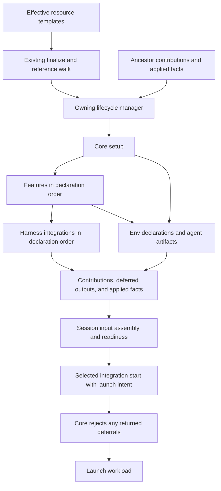

# Harness Scope Framework: High-Level Architecture

- Status: Proposed architecture for draft review; no merge or implementation intent yet
- Date: 2026-09-06
- Requirements: [FRD](frd.md), R1 through R13
- Saga: [next-steps](../2026-08-04-next-steps/target-state.md), wave 4
- Governing design: [scope participation](../2026-08-04-next-steps/scope-participation-contract.md)
  and [capability descriptors](../2026-08-04-next-steps/capability-descriptor-contract.md)
- Code baseline: `0c8cf6bc77dd49a2a30440cde0326f37a3980689`

The [operator's artifact-delivery ruling](frd.md#operator-ruling-artifact-delivery-2026-09-06)
replaces the original all-payload session rollup with typed artifacts and integration-specific
deferral, retaining small setup instructions alongside rules and skills. This draft carries the
authorized FRD amendment and its architecture response together; the saga lead owns reconciling the
superseded shared-contract wording.

## Architecture in one view

Each resource's existing lifecycle drives a small setup pipeline: core, ordered features, then
ordered harness integrations. Core supplies the resource identity, execution target, inherited env,
and artifacts. An integration receives the config for the facet being invoked and owns its harness's
representation and applied facts. Each invocation returns artifacts it defers; core delivers those
to later applicable invocations of the same integration. Sessions consume accumulated env and the
remaining artifact payloads, diagnose missing setup, and cannot launch with unresolved deferrals.
They do not run ancestor setup as a side effect of starting a workload.

The pipeline is shared orchestration code, not a registry of scopes or an extensible execution
engine. Resource managers retain activation, preflight, secret resolution, realization, error
framing, and rollback. Existing Python models, capability descriptors, transports, and SQLite
instance state remain the stack. There is no new runtime service or dependency.

## Where the current code changes

These anchors describe the baseline, not the proposed implementation's eventual line numbers.

| Existing seam                                                                 | Architectural change                                                                                                                                                          |
| ----------------------------------------------------------------------------- | ----------------------------------------------------------------------------------------------------------------------------------------------------------------------------- |
| `cli/agentworks/capabilities/harness_integration/base.py:202`                 | Separate common config binding from the session-only constructor, target guard, probe cache, and conversation state. Add setup invocation methods to this one registered API. |
| `cli/agentworks/capabilities/base.py:339` and `capabilities/config.py:517`    | Extend `config_for` and its cached model selection to preserve the facet in every downstream consumer.                                                                        |
| `cli/agentworks/capabilities/descriptor.py:159`                               | Replace the single hosted field assumption with the concrete hosting surfaces this effort introduces.                                                                         |
| `cli/agentworks/vms/initializer/driver.py:396` and `agents/initializer.py:31` | End each owning scope's core setup with features and integration setup; remove Claude-specific dispatch.                                                                      |
| `cli/agentworks/workspaces/realize.py:50`                                     | Run workspace participants inside the shared create body, before the workspace is declared complete.                                                                          |
| `cli/agentworks/env/entry.py:69` and `env/merge.py:19`                        | Reuse env declarations and the existing precedence ladder; incorporate producer contributions without persisting resolved secrets.                                            |
| `cli/agentworks/db/instance_state.py:37`                                      | Register closed keys and domain codecs for setup contributions and harness applied facts; retain the existing table.                                                          |
| `cli/agentworks/plugins/claude/harness_integration.py:129`                    | Own user plugin reconciliation, workspace materialization, session hoisting, and upstream diagnostics.                                                                        |

## Resource ownership and attachments

The five setup/runtime scopes and four capability facets remain distinct. `OperationScope` currently
describes the command's identity and also includes a system level. It is not the five-scope setup
model and must not become the facet selector. Core's consuming resource chooses the facet once. A
scope names the resource/lifecycle boundary; a facet pairs the API methods and config an integration
implements. An artifact originates at a scope, possibly emitted before any harness method runs. An
integration handles it through a facet invocation for a concrete resource. Admin and agent stay
distinct scopes and both use the user facet; deferral never changes the origin.

| Owning scope | Config and selection surface                                    | Facet and operation          | Persistent owner          |
| ------------ | --------------------------------------------------------------- | ---------------------------- | ------------------------- |
| VM           | `vm-template.harness_integrations`                              | vm, `vm_init`                | VM                        |
| Admin        | Selected `admin-template.harness_integrations` (proposal below) | user, `user_init`            | VM, admin setup component |
| Agent        | `agent-template.harness_integrations`                           | user, `user_init`            | Agent                     |
| Workspace    | `workspace-template.harness_integrations`                       | workspace, `workspace_init`  | Workspace                 |
| Session      | Existing `session-template.harness_integration`                 | session, `start(intent=...)` | Session                   |

Broader attachments are ordered lists of tagged capability config blocks. Each block has the
existing `name` discriminator and only that facet's fields. A resource may select an integration
once per facet invocation; duplicate names in one effective list are a config error. Empty lists
select none. Session selection stays singular and preserves its current shell fallback.

An attachment does not enable its plugin globally, select a session workload, or implicitly attach
the integration to an ancestor or descendant. Existing plugin enablement and graph miss policies
apply. An ancestor selecting a different integration or none does not consume its artifacts for this
integration: original contributions remain available to establish that integration's input. An
integration's deferred output never changes another integration's delivery.

**Admin attachment proposal, for confirmation:** place selection and user config together on the
already-selected admin-template, using the same list shape and user-facet schema as agent templates.
The VM already records `admin_template`, selects it with `--admin-template`, and supports an
independent `--admin-spec` overlay (`cli/agentworks/instance_specs.py:105`). This avoids a second
admin selection/config join on the vm-template. FRD open question 3 explicitly asks about a
vm-template spelling, so this is a proposed answer requiring confirmation, not a silent amendment.
If a separate VM attachment is required, settle its ownership before the plan and LLD.

For inheriting templates, the attachment list replaces as a whole when authored by a nearer layer;
omission inherits and an explicit empty list removes the inherited selection. Each block still uses
its model's defaults and validation. This makes effective execution order explicit without adding
list-item patching, dependency declarations, or integration priority knobs. The admin-template keeps
its existing non-inheriting behavior, and instance overlays follow the same field policy.

## Facet config is ordinary capability config

Keep `config_model` as the single-config declaration and `config` as the bound validated instance.
Extend `config_for(facet=None)` rather than adopting the old `config_at` sketch or shadowing the
bound `config` property. A single-config capability ignores the optional selector and remains
unchanged. `HarnessIntegration` supplies the session-only default mapping for existing integrations:
its `config_model` is the session answer and setup facets offer no config. A multi-facet integration
overrides `config_for` for the fixed vm, user, workspace, and session vocabulary. Calling a
multi-facet selection without the consumer's facet must not silently select session config.

No offered model means an attachment accepts its selection tag and no config fields. It still may
invoke a method. Offering a model is neither a support claim nor a permission to invoke anything.
Only the harness kind enumerates the four facet answers during registration/finalize; ordinary
capabilities do not acquire per-facet declaration tables or new obligations.

Core records each hosting field's selected facet alongside its existing capability-block metadata.
Admin and agent hosting fields both select user. Harness reference output groups all four facet
schemas, including an answer with no config; a reference to a particular resource field renders
exactly that field's answer. The frozen descriptor carries a sequence of hosting surfaces with
singular or list cardinality, replacing its current one-field assumption. That metadata describes
consumers; implementations never receive a consumer kind as their config selector.

The model selected and checked at registration remains the model used for validation, merge,
references, secret extraction, and schema output. Extend the current offered-model cache by facet;
retain the current declaration-sensitive cache identity so registration, declaration replacement,
and snapshot restoration cannot reuse a mismatched answer. Cache tagged unions by kind, selected
facet, and the actual selected model arms. Preserve effective-layer validation and provenance,
including errors pointing to the block and declaring resource.

The pre-design call-site walk identifies these obligations:

| Consumer                                                                              | Required behavior                                                                                                                                               |
| ------------------------------------------------------------------------------------- | --------------------------------------------------------------------------------------------------------------------------------------------------------------- |
| `capabilities/config.py`: structural references, construct validation, and model maps | Receive the hosting field's selector; choose one model per blob.                                                                                                |
| `capabilities/conformance.py`                                                         | Validate all harness answers at registration and retain the public `register_plugin` boundary checks for non-callable hooks, invalid models, and hook failures. |
| `capabilities/base.py` constructor                                                    | Bind config and extract secrets from the same cached selected model; do not make a second uncached hook call.                                                   |
| `manifests/field_tree.py` and `manifests/reference.py`                                | Render the correct facet at a resource field and all facets at the harness capability root.                                                                     |
| `manifests/spec_model.py`, `manifests/decode.py`, and schema walkers                  | Walk every attachment element with its index, facet, and owner; preserve tagged shape, shorthand policy, reference edges, and value-safe errors.                |
| Secret backend primary and mapping config                                             | Keep their ordinary config behavior and distinct `mapping_model` contract. They are not harness facets.                                                         |

The registries themselves are already typed. Narrow the heterogeneous descriptor accessor's class
type where needed and remove only wrappers made unnecessary by that change. `mapping_model` is a
separate contract, not residue to fold into this migration. Do not combine this work with unrelated
capability cleanup. The hook's public caller boundary remains real even while implementations are
first-party.

## Invocation API and execution

Retain `vm_init`, `user_init`, and `workspace_init` as the method names. Each receives a typed
invocation for its facet and reports applied facts through a manager-owned checkpoint channel; the
base defaults perform no work, report no applied facts, and return every input artifact as deferred.
Setup results carry the deferred collection and an integration-authored reason for each item.
`start` retains `HarnessLaunchIntent` and the current launch-result alternatives; its successful
result adds the same deferred collection alongside the proposed launch command. Core checks it
before launching the workload. Ordinary execution failures and unsupported launch intents retain
their existing error/result paths, distinct from artifact deferral. The contract version increments
from 3 across the descriptor and all four first-party integrations. `start` remains the required
operation; the inherited setup defaults satisfy R3 without a supported scope registry. Existing
session probe obligations remain on the session path.

Construct an integration binding for one owning resource and facet. A present attachment supplies
its effective config and contributions; an absent attachment supplies prior ownership for retirement
without validating absent config or inventing defaults. Both use the same facet method. Give setup
methods only the invocation that belongs to that resource: VM identity and system runner for vm;
username, home, and user runner for user; workspace identity, root, and setup runner for workspace.
Each also receives artifacts, previous applied facts for this integration, an applied-fact
checkpoint channel, and an env view carried by the runner. Core binds the user invocation to its
user. Origin metadata is descriptive provenance, not another dispatch mechanism.

Session construction adds session identity, workspace, workload target, launch readiness cache, and
conversation state. None of those fields is required to construct setup bindings. Conversely, a
session binding is never lent to a setup operation. The existing readiness identity checks remain
session-specific; setup readiness is attached to the owning graph node and lifecycle.

Run targets are lightweight views over existing transports with the invocation's env already bound.
They delegate file operations and execution rather than adding another transport implementation.
Per-call env can add command-specific values, while core identity variables remain authoritative.
This is delivery and convenience, not a sandbox: trusted integration code can access the underlying
system, and review enforces scope discipline.

VM initialization completes the VM pipeline before driving the admin pipeline. Agent initialization
runs independently on its VM. Workspace creation is VM-owned and does not choose an agent identity.
Existing orchestration orders prerequisites when session creation also creates resources; only those
explicitly requested creations may run setup. Starting an existing session never does so.

Features use the existing descriptor/registration pattern as the three core-owned kinds
`vm-feature`, `agent-feature`, and `workspace-feature`. They have one config and one idempotent
setup operation, return env/artifact contributions, and are selected in a `features` list with the
same ordering and replacement rules as attachments. The user setup pipeline consumes the
agent-feature API for both concrete users, so features do not introduce duplicate admin
implementations. Concrete test implementations registered as vm-feature, agent-feature (covering
both user scopes), and workspace-feature exercise every lane through the real CLI in the vertical
acceptance run, proving env and artifact delivery. There is no session-feature.

## The two currencies

**Env uses the shipped `EnvEntry` shape:** a plaintext value or a declared secret reference. Core
and feature outputs are ordered maps of those entries with producer provenance. Later producers
replace earlier values within a scope. Reuse the shipped cross-scope precedence:
`vm < workspace < (admin or agent) < session`; admin and agent never merge together. Pipeline order
within one scope does not change that precedence. Core-protected identity variables win last.

A user setup sees VM plus that user's env. Workspace setup sees VM plus workspace env, never an
arbitrary user's env. A session combines VM, workspace, its actual user, and session contributions.
Env precedence is not an artifact placement ladder. Artifact routing follows the actual resource
relationships: VM to user or workspace, then those applicable ancestors to session. Agent and
workspace are siblings, not ancestors of one another. Each invocation receives local artifacts plus
applicable inherited items still deferred for its integration, preserving their individual origins.

Template env becomes pipeline input alongside core-produced values. Existing bootstrap and core
install commands retain their hermetic runners. The new feature and integration lanes receive the
explicit env-to-date runner; this is the intentional extension beyond today's runtime-only env
injection. Their secret needs join the owning operation's existing preflight and resolution
boundary. A feature declares all secret references it may emit through its config before execution.
Its output may use that declared set but cannot introduce a secret lookup after the boundary
resolves. Runtime values exist only in the operation's runner and scoped secret view.

**Agent artifacts have three concrete kinds: instruction, rule, and skill.** Instructions describe
Agentworks setup; rules and skills follow a reduced Rulesync model. None is a target filename:

| Kind        | Content and behavior preserved through delivery                                                                                                                                                                                                           |
| ----------- | --------------------------------------------------------------------------------------------------------------------------------------------------------------------------------------------------------------------------------------------------------- |
| Instruction | A producer-local name and short, non-secret setup fact, such as an available env variable or successful tool authentication. It carries no separate rule applicability or skill invocation metadata.                                                      |
| Rule        | A producer-local name, instructional text, and applicability: always applying or matching declared workspace-relative paths. The integration preserves that applicability when representing the rule.                                                     |
| Skill       | A producer-local name, discovery description, instructions, and a bundle of supporting files addressed relative to the skill root. Preserve the package and its discovery/invocation semantics; appending its instructions to a prompt is not equivalent. |

Core attaches immutable origin metadata: owning scope, resource identity, and producer (core or the
named feature). Together with the producer-local name, these identify an item across delivery;
duplicate names within a producer are errors. A facet is not an independent origin field: core's
fixed mapping derives the corresponding facet from the origin scope. The enclosing invocation or
persisted result identifies the current facet and resource; each returned item adds only its reason
to its original identity. No per-item attempt history is stored.

The name and origin form a pipeline source address, not wave 6's global artifact identity. Content
and applicability remain distinct from identity and from native destination. Skill members preserve
relative paths and non-secret contents so references and scripts travel with their instructions;
source paths are not destinations or permission to copy arbitrary host files. Package ingestion
validates relative paths and refuses escapes. The LLD settles the concrete bundle carrier and codec.

Core and features may emit these typed artifacts alongside env. An env declaration may be
accompanied by an instruction describing the variable; a successful user authentication feature may
emit an instruction that its tool is available. Descriptions contain no secret value. A claim about
completed setup is emitted only after that setup succeeds. Their producer API does not depend on a
manually authored template-artifact field, so that operator surface can follow immediately without
changing delivery. It is not required in this effort. Session inputs may likewise come from core;
this does not add a session-feature or change the shipped workload config knobs.

Limited hooks can later join as a distinct kind carrying explicit event and execution semantics. Do
not flatten kinds into arbitrary text or executable strings, erase provenance, or turn a skill into
a rule as a fallback. Global identity, attributed composition, hook execution, an artifact registry,
and distillation remain wave 6 work. Simple instruction grouping is native rendering, not that
future composition system. All three kinds get concrete shapes now and are proven by the vertical.

A resource publishes successful core/feature contributions and each invoked integration's deferred
output to the instance-state store. Later operations reconstruct inputs without rerunning ancestor
setup. Persist env declarations and non-secret artifact content, including skill members, in the
versioned domain payload. An output schema has no resolved-secret arm. Integrations must not copy
secret values into artifact content, logs, hashes, reasons, or state. Trusted-code review and
negative runtime tests enforce that conduct; schema shape alone cannot. Secret env references
resolve afresh at the consuming operation boundary.

## Representation, ordering, and conflicts

Integrations run after core and every feature that emits env or artifacts. Features consume
env-to-date in template declaration order. Each integration receives the completed local outputs,
all applicable env, and its own inherited deferred artifacts. Integrations run in attachment order
but do not feed one another. A failed integration stops setup; deferral is an ordinary successful
setup result, not an error until the final session facet. Ordering never makes the last integration
the winner of a destination collision.

**Native placement at the defining scope is the ordinary case.** The integration decides what its
harness can represent at each invocation. A user-facet invocation normally installs a user skill
under that user's native skill directory. Instructions may be grouped into one native rule for an
owning resource/facet invocation or deferred to a launch prompt. Grouping retains each contributing
item's origin and applies or defers those original items, not a replacement artifact with a new
origin. An item omitted from the successful deferred output is handled for that integration and
applicable resource path; later invocations need no payload copy. Handling for Claude neither
handles it for Codex nor handles it for another user.

Setup results return only the items left deferred, preserving the original artifacts and attaching
specific reasons. The no-op default defers every item. There is no separate handled-item result or
per-artifact acknowledgment ledger. Applied-state receipts still describe actual managed writes for
ownership, convergence, and readiness; they are not the delivery mechanism.

Core assembles pending payloads using contribution snapshots and successful deferred outputs for the
same input revisions. An absent integration provides no handling evidence, so that path passes
artifacts unchanged. A failed invocation or unknown/stale snapshot cannot imply handling through
absence. At a session, combine the workspace branch and the selected user's branch by originating
item, not text equality. A VM-origin item handled by an applicable user invocation must not reappear
merely because the workspace branch deferred it. Absence means handled only where that same item
revision was in a completed invocation's input. Source snapshots and deferred outputs establish
this; an additional acknowledgment table is unnecessary. Each integration chooses a consistent
materialization facet for an inherited item from its kind, origin, and applicability. Sibling setup
does not race to handle whatever appears unclaimed: the integration's other facet defers that item,
without consulting sibling state or adding core coordination.

**Core enforces final completion.** A successful session-facet result carries the same deferred
collection as a setup result. Any remaining entry becomes a typed core error before launching the
workload. The error identifies the artifact and immutable origin, the current session invocation,
and the integration's own reason. This preserves harness-specific explanations while putting the
terminal check in one place. Core enforces the returned contract; integration code and tests remain
responsible for actually applying everything it omits. Execution errors still raise normally.

A harness may use a workload-specific input or a privately referenced package to handle a deferred
artifact at the session facet, if that preserves the artifact's semantics. It must not place
session-only content in a user or workspace auto-discovery directory shared with other sessions. If
the harness has no suitable session mechanism, it defers with a reason and core refuses launch.
Plain instructions may be delivered through the launch prompt; that is not a universal fallback for
rules or skills with additional semantics. Already handled payloads stay upstream; their applied
receipts remain available to session readiness for prerequisite and drift checks.

For every materialization, claim the smallest practical ownership unit: a rule file, a managed
member, or the files of a skill package, never an entire repository configuration directory. Inspect
the live destination against recorded ownership and hashes before changing it. Unclaimed existing
content is a conflict even when bytes match; changed owned content is drift. Neither is silently
adopted, overwritten, or deleted. Report resource, integration, and destination without content.
Core can report conflicting recorded claims across integrations; integrations still inspect actual
destinations because state can be stale. There is no cross-integration merge policy or claim that
these checks constrain arbitrary trusted in-process side effects.

## Applied state and convergence

Use the existing instance-state store, with closed keys for scope contributions and harness applied
state. The VM payload separates VM setup from admin setup; agent, workspace, and session owners use
their own rows. Inside each harness payload, integration names separate versioned records. The store
schema needs no new table and no key per integration. Conversation state remains in its existing
session namespace; an artifact record does not replace a harness conversation ID.

Persist each integration's successful deferred collection together with its input revision
references and the scope's published contributions. This identifies which outputs can still be used
for delivery after config changes or reinit; it is not a historical record of every attempt.
Preserve source content needed by another integration and earlier applied receipts needed for
cleanup. Before the first setup mutation, invalidate the prior completed delivery snapshot while
retaining its content and receipts for reconciliation. A failed reinit cannot leave that old
completion eligible, even when input revisions have not changed. Publish a new completed snapshot
only after success. An invalidated or incomplete snapshot is an upstream setup-state failure:
session readiness reports the owning recovery operation instead of treating it as an empty deferred
result or manufacturing new deferrals that might duplicate partly applied content.

An applied record carries its payload version, contributing source locators, destination or native
resource, representation strategy, non-secret content hash where meaningful, and confirmed outcome.
The owning manager persists facts from completed work, using partial slice replacement so another
scope, another integration, and unknown future keys survive. Successful feature/core contributions
and the evidence describing their application must describe the same setup generation. Readiness
must not combine fresh desired config with stale receipts and call that applied success.

Reinit recomputes desired output and reconciles it with the prior record and live destination. It
writes changed owned content, leaves matching content alone, and removes obsolete owned units only
when their ownership and recorded content still match. Removed attachments must also be reconciled:
the manager retains their records and invokes the same facet method with an absent-attachment
desired state before dropping confirmed removals. This means no desired integration-owned resources,
including config-driven plugins and marketplaces, not merely an empty artifact list. Prior applied
facts retain the non-secret identifiers needed to undo owned work independently of current config.
If its plugin is unavailable, report pending cleanup and retain evidence; never erase the record and
pretend cleanup happened.

Each completed mutation checkpoints its applied facts before the next mutation. The manager owns
persistence and acknowledges the checkpoint only after it succeeds; persistence failure stops
further writes. Thus a later exception preserves the successfully recorded prefix, without requiring
a successful method return to recover it. Contributions and deferred outputs become the published
scope snapshot only on successful scope completion; partial integration receipts remain
distinguishable from that completed snapshot. For a new workspace, the checkpoint channel buffers
facts until the creation commit, because its failed partial work is unwound as described below.

Remote writes and SQLite are not a distributed transaction. A process can die after a remote change
and before recording it. Treat any unexplained residue on retry as unowned until the integration can
prove the original claim from durable evidence. Do not silently adopt matching bytes. Unknown future
payload versions remain uninterpreted evidence; malformed known records yield safe diagnostics and
no trusted ownership. Neither grants permission to overwrite. Domain codecs migrate recognized old
versions; partial replacement preserves unknown well-formed store keys as required by the saga
ruling.

Serialize setup for the same owning resource across command executions, covering observation, remote
mutation, and receipt persistence. This prevents two reinitializations from both claiming the same
prior hash. A competing setup refuses with the owning resource and retry guidance instead of
queueing. The LLD must choose a lock with that actual cross-process lifetime; a SQLite write
transaction held across network calls is not the design.

## Workspace retry and session readiness

Workspace setup participates in `realize_workspace`, shared by standalone create and
`session create --new-workspace`. Run features and integrations after the directory and repository
exist but before publishing successful creation. Commit the workspace row, desired overlay,
contributions, deferred outputs, and initial applied facts together only after setup succeeds.

On a handled failure before that commit, unwind the newly created workspace directory, group, and
local stub using the existing partial-create path. A retry is another `workspace create` with the
same inputs after successful cleanup. A cleanup failure or process crash reports residue and refuses
to adopt a pre-existing path on retry; the operator inspects and removes or relocates it before a
fresh create. This deliberately avoids adding a workspace reinit command or a durable partial-create
state machine. Once creation commits, later session failure follows the existing orchestrator's
completed-resource retention or teardown policy. No integration may write outside the new workspace
as part of workspace setup and expect that rollback to cover it.

Session readiness asks the selected integration to check upstream facts and inexpensive probes for
its own prerequisites. Core supplies applicable ancestor records and owner remediation references;
the integration need not invent an admin-versus-agent command. Required gaps raise the existing
typed error with the owning repair operation. Recommended gaps warn and allow degraded operation.
Missing optional broader attachments are not automatically required: a session-only integration with
no artifact inputs keeps working. No supported-scopes report is introduced; schema output describes
config, and doctor reports actual readiness rather than inferring support from overrides or model
presence.

For VM/admin and agent drift, remediation points to VM or agent reinit respectively. For workspace
materialization problems, report the specific path and create-only lifecycle, with inspection and
explicit recreation guidance. Do not imply `workspace repair` reruns this pipeline. Successfully
handled upstream artifacts are not silently reclassified as deferred after drift. Readiness reports
that missing prerequisite through the owning operation. A deferred artifact may be handled at the
session facet only if that preserves its semantics and workload applicability; it cannot quietly
repair a required upstream gap. Final nonempty deferral is always a launch error, independent of the
required/recommended classification of other readiness prerequisites.

## Claude vertical slice and migration

Claude Code proves the design end to end. Its user facet owns `marketplaces` and `plugins`, migrated
from core's `claude_marketplaces` and `claude_plugins`. Its reconciliation compares native installed
state and prior ownership, handles removals only for resources it owns, and uses the same user
method for admin and agents. Core invokes an integration; it contains no Claude-specific field,
import, installer branch, or default selection.

Its user and workspace facets group setup instructions into owned rules where suitable and
materialize declared rules and complete skill packages at native user and project destinations,
subject to ownership checks. Claude documents rules under `.claude/rules/` and skills under
`.claude/skills/` at those levels. A user skill successfully handled by `user_init` is absent from
subsequent session payloads; session readiness can still check its installation. Instructions
deferred to the session can join the launch prompt without losing their original attribution. The
integration records every source contributing to a grouped rule, so reinit can remove or update one
instruction without retaining stale text or claiming unrelated content.

For inherited VM-origin artifacts, Claude's user facet owns any suitable native user placement; its
workspace facet passes them onward and materializes workspace-origin artifacts only. This choice
holds whether user or workspace setup runs first. Items without a faithful user representation
remain deferred for the session facet. The session facet must preserve rule applicability and skill
package behavior when using any session-specific mechanism; otherwise it returns a reason and core
refuses launch. Existing `append_system_prompt` remains supported, but it is not a general
substitute for a rule or a skill. The integration owns how setup instructions and any compatible
session rule representation combine with that explicit config.

Rulesync informs the rule/skill model and separation of sources from generated destinations; it is
not invoked at runtime. Exact file names, package delivery, available session mechanisms, and native
plugin ownership probes belong in the LLD and must be verified against the actual CLI. The vertical
acceptance includes grouped instructions, native user and workspace rules/skills, downstream
filtering, unchanged skill support files, and terminal refusal for an unrepresentable artifact.
These are integration details, not core special cases.

Update first-party manifests and upgrade guidance in the implementation change. Retire old template
fields and the two core install call sites together; do not leave two active configuration paths.
Old declarative input receives normal unknown-field framing with actionable migration guidance.
Persisted desired overlays that use the old fields require an explicit codec migration into the user
attachment, preserving existing values and rejecting ambiguous old/new combinations. Existing native
installations are inspected, not automatically claimed as owned just because old config mentioned
them. The migration strategy must explain how an operator deliberately establishes ownership or
removes conflicting old material before reconciliation can manage it.

This review PR contains the FRD amendment and HLA. It contains no plan, LLD, permanent behavior
docs, or migration file. The next artifacts must specify the storage/locking and interruption
protocol, schema-host walk, Claude reconciliation, and config/overlay migration before
implementation begins. Their acceptance must include copy, rehome, delete, and state restore
handling so owner records cannot bless artifacts at a different destination or survive deletion and
recreation under the same name.

## Validation and requirement coverage

Implementation evidence must include these observable cases, through the real CLI and a live backend
where setup changes the guest:

| Requirement                               | Acceptance evidence                                                                                                                                                                                                                                                                |
| ----------------------------------------- | ---------------------------------------------------------------------------------------------------------------------------------------------------------------------------------------------------------------------------------------------------------------------------------- |
| R1, R2, R6                                | Feature fixtures for all three kinds receive env-to-date and emit env, instructions, rules, and skills; integrations run after all producers; VM, admin, agent, and workspace ordering is observed.                                                                                |
| R3, R4, R5, R8                            | A session-only integration remains compatible; different facet schemas validate on the proper resource, invalid public plugin hooks fail at registration, and setup never carries session identity/cache/state.                                                                    |
| R7, R12                                   | Instructions, rules, and skill bundles retain semantics and origin through grouping and delivery; handled payloads do not reach session, deferral is integration-specific across both ancestor branches and creation orders, and any final deferral blocks launch with its reason. |
| R9                                        | Repeated VM/admin and agent setup is unchanged; desired changes/removals converge; edited/unowned files cause drift/conflict reports; failed same-input reinit invalidates completion; interrupted work, unknown versions, and concurrent                                          |
| reinit do not overwrite or lose evidence. |
| R10                                       | Required and recommended upstream gaps produce different outcomes with the correct owning remediation and no upstream mutation from session start/restart.                                                                                                                         |
| R11, R13                                  | Fresh and existing Claude admin/agent config migrates; marketplace/plugin changes reconcile; core has no Claude-specific knowledge (the existing generic shell fallback remains); workspace create materializes real content, failure cleans partial output, and retry succeeds.   |

Schema/reference checks cover manifest, config, instance overlay, explain/reference, and secret
preflight parity for every new hosting field. Negative secret tests inspect persisted state and
captured diagnostics. These tests assert behavior and data boundaries, not the wording of authored
prose. Permanent capability, orchestration, env, idempotency, sample config, completion, and guide
collateral changes travel with the behavior that makes them true.

## Focus for architecture feedback

The five FRD open questions have proposals here: typed facet invocations and existing env entries;
no supported-scopes reporting mechanism; admin-template attachment ownership pending confirmation;
workspace cleanup then fresh create; and ordered attachments with conflicts instead of overwrite.
The highest-risk boundaries are facet selection through all schema consumers, rule/skill fidelity,
merging deferred inputs across sibling ancestors without duplicate delivery, non-secret
contributions across executions, and recovery between a remote write and a local receipt. The
architecture does not claim those are solved by no-op defaults or by a state table alone.

## Sources checked for this response

- Repository code at the baseline above, plus the FRD's governing saga artifacts and the corrected
  [config-shape message](../2026-08-04-next-steps/message-2026-08-16-capability-config-shape.md).
- [Claude Code memory documentation](https://code.claude.com/docs/en/memory), checked 2026-09-06:
  project and user rules provide native instruction destinations; shared discovery is why hoisted
  session content requires separate delivery.
- [Claude Code skill documentation](https://code.claude.com/docs/en/skills), checked 2026-09-06:
  native user/project skill packages establish the vertical integration's placement candidates.
- [Rulesync file formats](https://rulesync.dyoshikawa.com/reference/file-formats.html), checked
  2026-09-06: rules preserve applicability and skills preserve instructions with supporting files;
  this response adopts those distinctions.
- [Rulesync CLI documentation](https://rulesync.dyoshikawa.com/reference/cli-commands.html), checked
  2026-09-06, and this repository's `CONTRIBUTING.md`: generation has source and target ownership;
  this architecture declines runtime generation or adoption of its outputs.
