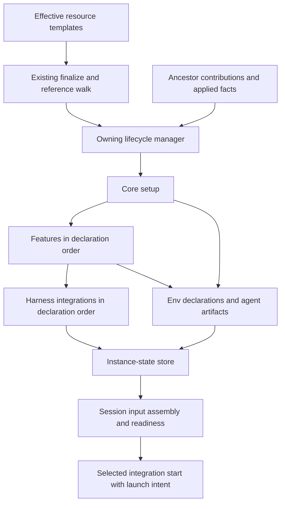

# Harness Scope Framework: High-Level Architecture

- Status: Proposed architecture for draft review; no merge or implementation intent yet
- Date: 2026-09-06
- Requirements: [FRD](frd.md), R1 through R13
- Saga: [next-steps](../2026-08-04-next-steps/target-state.md), wave 4
- Governing design: [scope participation](../2026-08-04-next-steps/scope-participation-contract.md)
  and [capability descriptors](../2026-08-04-next-steps/capability-descriptor-contract.md)
- Code baseline: `d7dfd6986d03daaa011f1c8a1d390cf25efb04fd`

## Architecture in one view

Each resource's existing lifecycle drives a small setup pipeline: core, ordered features, then
ordered harness integrations. Core supplies the resource identity, execution target, inherited env,
and artifacts. An integration receives the config for the facet being invoked and owns its harness's
representation and applied facts. Sessions consume the accumulated inputs and diagnose missing
setup; they do not run ancestor setup as a side effect of starting a workload.

The pipeline is shared orchestration code, not a registry of scopes or an extensible execution
engine. Resource managers retain activation, preflight, secret resolution, realization, error
framing, and rollback. Existing Python models, capability descriptors, transports, and SQLite
instance state remain the stack. There is no new runtime service or dependency.

## Where the current code changes

These anchors describe the baseline, not the proposed implementation's eventual line numbers.

| Existing seam                                                                 | Architectural change                                                                                                                                                          |
| ----------------------------------------------------------------------------- | ----------------------------------------------------------------------------------------------------------------------------------------------------------------------------- |
| `cli/agentworks/capabilities/harness_integration/base.py:202`                 | Separate common config binding from the session-only constructor, target guard, probe cache, and conversation state. Add setup invocation methods to this one registered API. |
| `cli/agentworks/capabilities/base.py:339` and `capabilities/config.py:517`    | Extend `config_for` and its cached model selection to preserve the facet in every downstream consumer.                                                                        |
| `cli/agentworks/capabilities/descriptor.py:159`                               | Replace the single hosted field assumption with the concrete hosting surfaces this effort introduces.                                                                         |
| `cli/agentworks/vms/initializer/driver.py:396` and `agents/initializer.py:31` | End each owning scope's core setup with features and integration setup; remove Claude-specific dispatch.                                                                      |
| `cli/agentworks/workspaces/realize.py:50`                                     | Run workspace participants inside the shared create body, before the workspace is declared complete.                                                                          |
| `cli/agentworks/env/entry.py:69` and `env/merge.py:19`                        | Reuse env declarations and the existing precedence ladder; incorporate producer contributions without persisting resolved secrets.                                            |
| `cli/agentworks/db/instance_state.py:37`                                      | Register closed keys and domain codecs for setup contributions and harness applied facts; retain the existing table.                                                          |
| `cli/agentworks/plugins/claude/harness_integration.py:129`                    | Own user plugin reconciliation, workspace materialization, session hoisting, and upstream diagnostics.                                                                        |

## Resource ownership and attachments

The five setup/runtime scopes and four capability facets remain distinct. `OperationScope` currently
describes the command's identity and also includes a system level. It is not the five-scope setup
model and must not become the facet selector. Core's consuming resource chooses the facet once.

| Owning scope | Config and selection surface                                    | Facet and operation          | Persistent owner          |
| ------------ | --------------------------------------------------------------- | ---------------------------- | ------------------------- |
| VM           | `vm-template.harness_integrations`                              | vm, `vm_init`                | VM                        |
| Admin        | Selected `admin-template.harness_integrations` (proposal below) | user, `user_init`            | VM, admin setup component |
| Agent        | `agent-template.harness_integrations`                           | user, `user_init`            | Agent                     |
| Workspace    | `workspace-template.harness_integrations`                       | workspace, `workspace_init`  | Workspace                 |
| Session      | Existing `session-template.harness_integration`                 | session, `start(intent=...)` | Session                   |

Broader attachments are ordered lists of tagged capability config blocks. Each block has the
existing `name` discriminator and only that facet's fields. A resource may select an integration
once per facet invocation; duplicate names in one effective list are a config error. Empty lists
select none. Session selection stays singular and preserves its current shell fallback.

An attachment does not enable its plugin globally, select a session workload, or implicitly attach
the integration to an ancestor or descendant. Existing plugin enablement and graph miss policies
apply. Sessions can use contributions from an ancestor even if that ancestor selected a different
integration or none: the currencies belong to the resource, not to a chosen renderer.

**Admin attachment proposal, for confirmation:** place selection and user config together on the
already-selected admin-template, using the same list shape and user-facet schema as agent templates.
The VM already records `admin_template`, selects it with `--admin-template`, and supports an
independent `--admin-spec` overlay (`cli/agentworks/instance_specs.py:105`). This avoids a second
admin selection/config join on the vm-template. FRD open question 3 explicitly asks about a
vm-template spelling, so this is a proposed answer requiring confirmation, not a silent amendment.
If a separate VM attachment is required, settle its ownership before the plan and LLD.

For inheriting templates, the attachment list replaces as a whole when authored by a nearer layer;
omission inherits and an explicit empty list removes the inherited selection. Each block still uses
its model's defaults and validation. This makes effective execution order explicit without adding
list-item patching, dependency declarations, or integration priority knobs. The admin-template keeps
its existing non-inheriting behavior, and instance overlays follow the same field policy.

## Facet config is ordinary capability config

Keep `config_model` as the single-config declaration and `config` as the bound validated instance.
Extend `config_for(facet=None)` rather than adopting the old `config_at` sketch or shadowing the
bound `config` property. A single-config capability ignores the optional selector and remains
unchanged. `HarnessIntegration` supplies the session-only default mapping for existing integrations:
its `config_model` is the session answer and setup facets offer no config. A multi-facet integration
overrides `config_for` for the fixed vm, user, workspace, and session vocabulary. Calling a
multi-facet selection without the consumer's facet must not silently select session config.

No offered model means an attachment accepts its selection tag and no config fields. It still may
invoke a method. Offering a model is neither a support claim nor a permission to invoke anything.
Only the harness kind enumerates the four facet answers during registration/finalize; ordinary
capabilities do not acquire per-facet declaration tables or new obligations.

Core records each hosting field's selected facet alongside its existing capability-block metadata.
Admin and agent hosting fields both select user. Harness reference output groups all four facet
schemas, including an answer with no config; a reference to a particular resource field renders
exactly that field's answer. The frozen descriptor carries a sequence of hosting surfaces with
singular or list cardinality, replacing its current one-field assumption. That metadata describes
consumers; implementations never receive a consumer kind as their config selector.

The model selected and checked at registration remains the model used for validation, merge,
references, secret extraction, and schema output. Extend the current offered-model cache by facet;
retain the current declaration-sensitive cache identity so registration, declaration replacement,
and snapshot restoration cannot reuse a mismatched answer. Cache tagged unions by kind, selected
facet, and the actual selected model arms. Preserve effective-layer validation and provenance,
including errors pointing to the block and declaring resource.

The pre-design call-site walk identifies these obligations:

| Consumer                                                                              | Required behavior                                                                                                                                               |
| ------------------------------------------------------------------------------------- | --------------------------------------------------------------------------------------------------------------------------------------------------------------- |
| `capabilities/config.py`: structural references, construct validation, and model maps | Receive the hosting field's selector; choose one model per blob.                                                                                                |
| `capabilities/conformance.py`                                                         | Validate all harness answers at registration and retain the public `register_plugin` boundary checks for non-callable hooks, invalid models, and hook failures. |
| `capabilities/base.py` constructor                                                    | Bind config and extract secrets from the same cached selected model; do not make a second uncached hook call.                                                   |
| `manifests/field_tree.py` and `manifests/reference.py`                                | Render the correct facet at a resource field and all facets at the harness capability root.                                                                     |
| `manifests/spec_model.py`, `manifests/decode.py`, and schema walkers                  | Walk every attachment element with its index, facet, and owner; preserve tagged shape, shorthand policy, reference edges, and value-safe errors.                |
| Secret backend primary and mapping config                                             | Keep their ordinary config behavior and distinct `mapping_model` contract. They are not harness facets.                                                         |

The registries themselves are already typed. Narrow the heterogeneous descriptor accessor's class
type where needed and remove only wrappers made unnecessary by that change. `mapping_model` is a
separate contract, not residue to fold into this migration. Do not combine this work with unrelated
capability cleanup. The hook's public caller boundary remains real even while implementations are
first-party.

## Invocation API and execution

Retain `vm_init`, `user_init`, and `workspace_init` as the method names. Each receives a typed
invocation for its facet and returns applied facts; the base defaults perform no work and return no
facts. `start` retains `HarnessLaunchIntent` and `HarnessStartResult`, extended with session inputs.
The contract version increments from 3 across the descriptor and all four first-party integrations.
`start` remains the required operation; the inherited setup defaults satisfy R3 without a supported
scope registry. Existing session probe obligations remain on the session path.

Construct an integration binding for one owning resource and facet from its effective config. Give
setup methods only the invocation that belongs to that resource: VM identity and system runner for
vm; username, home, and user runner for user; workspace identity, root, and setup runner for
workspace. Each also receives artifacts, previous applied facts for this integration, and an env
view carried by the runner. Core translates its admin/agent distinction into the concrete user; an
integration author implements one `user_init` body without an admin or agent branch.

Session construction adds session identity, workspace, workload target, launch readiness cache, and
conversation state. None of those fields is required to construct setup bindings. Conversely, a
session binding is never lent to a setup operation. The existing readiness identity checks remain
session-specific; setup readiness is attached to the owning graph node and lifecycle.

Run targets are lightweight views over existing transports with the invocation's env already bound.
They delegate file operations and execution rather than adding another transport implementation.
Per-call env can add command-specific values, while core identity variables remain authoritative.
This is delivery and convenience, not a sandbox: trusted integration code can access the underlying
system, and review enforces scope discipline.

VM initialization completes the VM pipeline before driving the admin pipeline. Agent initialization
runs independently on its VM. Workspace creation is VM-owned and does not choose an agent identity.
Existing orchestration orders prerequisites when session creation also creates resources; only those
explicitly requested creations may run setup. Starting an existing session never does so.

Features use the existing descriptor/registration pattern as the three core-owned kinds
`vm-feature`, `agent-feature`, and `workspace-feature`. They have one config and one idempotent
setup operation, return env/artifact contributions, and are selected in a `features` list with the
same ordering and replacement rules as attachments. The user setup pipeline consumes the
agent-feature API for both concrete users, so features do not introduce duplicate admin
implementations. The first concrete feature is a harness-neutral context feature that emits
configured env and instruction artifacts, proving that features actually feed the integration lane.
There is no session-feature.

## The two currencies

**Env uses the shipped `EnvEntry` shape:** a plaintext value or a declared secret reference. Core
and feature outputs are ordered maps of those entries with producer provenance. Later producers
replace earlier values within a scope. Reuse the shipped cross-scope precedence:
`vm < workspace < (admin or agent) < session`; admin and agent never merge together. Pipeline order
within one scope does not change that precedence. Core-protected identity variables win last.

A user setup sees VM plus that user's env. Workspace setup sees VM plus workspace env, never an
arbitrary user's env. A session combines VM, workspace, its actual user, and session contributions.
The same ordering applies to artifact delivery; unlike env, artifact delivery retains individual
items instead of flattening them by text equality.

Template env becomes pipeline input alongside core-produced values. Existing bootstrap and core
install commands retain their hermetic runners. The new feature and integration lanes receive the
explicit env-to-date runner; this is the intentional extension beyond today's runtime-only env
injection. Their secret needs join the owning operation's existing preflight and resolution
boundary. A feature declares all secret references it may emit through its config before execution.
Its output may use that declared set but cannot introduce a secret lookup after the boundary
resolves. Runtime values exist only in the operation's runner and scoped secret view.

**Agent artifacts start as instruction documents.** The input envelope contains a kind (initially
instruction), non-secret text, and a producer-local name. Core attaches the owning resource and
producer address, giving the integration an unambiguous source locator for reporting and applied
state. Resource templates may declare instruction artifacts directly, including session templates;
features can emit them. Duplicate names from one producer fail at its input/output boundary.

The source locator is an address for this pipeline, not wave 6's global artifact identity. Do not
use a destination filename or content hash as identity, flatten source attribution away, or model
artifacts as arbitrary executable strings. This leaves room for wave 6 to add stable identities,
composition, and distinct typed hooks without claiming to implement them now. No hook executor,
artifact registry, merge language, or distillation subsystem ships in this effort.

A resource publishes its successful core/feature contributions to the instance-state store so a
later session does not rerun setup to recover them. Persist declarations and non-secret instruction
content only. An output schema has no resolved-secret arm; integrations must not copy secret values
into text, logs, hashes, or state. Schema shape cannot police arbitrary trusted code, so disclosure,
review, and negative runtime tests enforce that conduct. Secret references are resolved afresh at
the consuming operation boundary, never recovered from persisted plaintext.

## Representation, ordering, and conflicts

All integrations at a setup scope receive the same completed core/feature inputs and run in the
effective attachment order. They do not feed env or artifacts to one another. A failed integration
stops the pipeline; completed work remains attributable for a retry. Ordering is deterministic but
never makes the last integration the winner of a destination collision.

Each integration maps inputs to its harness's native destinations or records that an input needs
session representation. Claim an individual file or managed member where practical, never an entire
repository configuration directory. Before changing a claimed unit, inspect its current content and
compare it with recorded ownership and hash. An unclaimed existing file is a conflict even when its
bytes match the proposed output. A changed owned file is drift. Neither case silently overwrites,
adopts, or deletes the file; report the resource, integration, and destination without content.

Integration state is namespaced, while core's owner-level view can report conflicting claims from
multiple integrations. Known claims are checked before mutation; integrations still inspect their
actual destinations because state can be stale. There is no cross-integration merge policy, and
checks over declared facts do not pretend to enforce trusted in-process side effects.

A session receives every applicable ancestor artifact with its attribution and applied evidence,
including material that already has a native representation. The selected integration determines
which native placements affect this workload, which need hoisting, and which inputs are already
represented. It must not deduplicate unrelated artifacts merely because their text hashes match.
Session-only material is passed through a workload-specific launch input or stored outside shared
harness auto-discovery and referenced only by this workload. It must never become an automatically
loaded workspace or user rule for neighboring sessions.

## Applied state and convergence

Use the existing instance-state store, with closed keys for scope contributions and harness applied
state. The VM payload separates VM setup from admin setup; agent, workspace, and session owners use
their own rows. Inside each harness payload, integration names separate versioned records. The store
schema needs no new table and no key per integration. Conversation state remains in its existing
session namespace; an artifact record does not replace a harness conversation ID.

An applied record carries its payload version, source locator, destination or native resource,
representation strategy, non-secret content hash where meaningful, and confirmed outcome. The owning
manager persists facts from completed work, using partial slice replacement so another scope,
another integration, and unknown future keys survive. Successful feature/core contributions and the
evidence describing their application must describe the same setup generation. Readiness must not
combine fresh desired config with stale receipts and call that applied success.

Reinit recomputes desired output and reconciles it with the prior record and live destination. It
writes changed owned content, leaves matching content alone, and removes obsolete owned units only
when their ownership and recorded content still match. Removed attachments must also be reconciled:
the manager retains their records and invokes the integration with an empty desired contribution set
before dropping confirmed removals. If its plugin is unavailable, report pending cleanup and retain
evidence; never erase the record and pretend cleanup happened.

Remote writes and SQLite are not a distributed transaction. A process can die after a remote change
and before recording it. Preserve completed receipts incrementally, and treat any unexplained
residue on retry as unowned until the integration can prove the original claim from durable
evidence. Do not silently adopt matching bytes. Unknown future payload versions remain uninterpreted
evidence; malformed known records yield safe diagnostics and no trusted ownership. Neither grants
permission to overwrite. Domain codecs migrate recognized old versions; partial replacement
preserves unknown well-formed store keys as required by the saga ruling.

Serialize setup for the same owning resource across command executions, covering observation, remote
mutation, and receipt persistence. This prevents two reinitializations from both claiming the same
prior hash. The LLD must choose a lock with that actual cross-process lifetime; a SQLite write
transaction held across network calls is not the design.

## Workspace retry and session readiness

Workspace setup participates in `realize_workspace`, shared by standalone create and
`session create --new-workspace`. Run features and integrations after the directory and repository
exist but before publishing successful creation. Commit the workspace row, desired overlay,
contributions, and initial applied facts together only after setup succeeds.

On a handled failure before that commit, unwind the newly created workspace directory, group, and
local stub using the existing partial-create path. A retry is another `workspace create` with the
same inputs after successful cleanup. A cleanup failure or process crash reports residue and refuses
to adopt a pre-existing path on retry; the operator inspects and removes or relocates it before a
fresh create. This deliberately avoids adding a workspace reinit command or a durable partial-create
state machine. Once creation commits, later session failure follows the existing orchestrator's
completed-resource retention or teardown policy. No integration may write outside the new workspace
as part of workspace setup and expect that rollback to cover it.

Session readiness asks the selected integration to check upstream facts and inexpensive probes for
its own prerequisites. Core supplies applicable ancestor records and owner remediation references;
the integration need not invent an admin-versus-agent command. Required gaps raise the existing
typed error with the owning repair operation. Recommended gaps warn and allow degraded operation.
Missing optional broader attachments are not automatically required: an unchanged session-only
integration keeps working. No supported-scopes report is introduced; schema output describes config,
and doctor reports actual readiness rather than inferring support from overrides or model presence.

For VM/admin and agent drift, remediation points to VM or agent reinit respectively. For workspace
materialization problems, report the specific path and create-only lifecycle, with inspection and
explicit recreation guidance. Do not imply `workspace repair` reruns this pipeline. A session may
hoist an input whose normal representation is unavailable only when doing so preserves the intended
workload behavior and prerequisite severity; it cannot quietly repair a required upstream gap.

## Claude vertical slice and migration

Claude Code proves the design end to end. Its user facet owns `marketplaces` and `plugins`, migrated
from core's `claude_marketplaces` and `claude_plugins`. Its reconciliation compares native installed
state and prior ownership, handles removals only for resources it owns, and uses the same user
method for admin and agents. Core invokes an integration; it contains no Claude-specific field,
import, installer branch, or default selection.

Its workspace facet materializes instruction artifacts in a dedicated file under `.claude/rules/`,
subject to ownership checks. User instructions use a dedicated user rules file. VM instruction
artifacts can remain unrepresented until session start rather than writing machine-wide Claude
policy. The session facet hoists those VM and session-local instructions through its existing launch
prompt machinery while accounting for the native user and workspace inputs it already loads.
Config-specific `append_system_prompt` remains supported and combines in a documented order with
pipeline instructions; this does not reopen the already-shipped session workload knobs.

The native directory choice is grounded in Claude's documented project and user rules support.
Rulesync's source-to-target generation motivates preserving attribution and leaving generated files
alone; it is not invoked by the runtime. Exact file names, byte-safe launch delivery, and native
plugin ownership probes belong in the LLD and must be verified against the actual CLI before
implementation is accepted. These are integration details, not core special cases.

Update first-party manifests and upgrade guidance in the implementation change. Retire old template
fields and the two core install call sites together; do not leave two active configuration paths.
Old declarative input receives normal unknown-field framing with actionable migration guidance.
Persisted desired overlays that use the old fields require an explicit codec migration into the user
attachment, preserving existing values and rejecting ambiguous old/new combinations. Existing native
installations are inspected, not automatically claimed as owned just because old config mentioned
them. The migration strategy must explain how an operator deliberately establishes ownership or
removes conflicting old material before reconciliation can manage it.

No plan, LLD, FRD revision, permanent behavior docs, or migration file is included in this review
PR. The next artifacts must specify the storage/locking and interruption protocol, schema-host walk,
Claude reconciliation, and config/overlay migration before implementation begins. Their acceptance
must include copy, rehome, delete, and state restore handling so owner records cannot bless
artifacts at a different destination or survive deletion and recreation under the same name.

## Validation and requirement coverage

Implementation evidence must include these observable cases, through the real CLI and a live backend
where setup changes the guest:

| Requirement    | Acceptance evidence                                                                                                                                                                                                                |
| -------------- | ---------------------------------------------------------------------------------------------------------------------------------------------------------------------------------------------------------------------------------- |
| R1, R2, R6     | A concrete feature receives env-to-date, emits env and instructions, and Claude receives them after core; VM, admin, agent, and workspace ordering is observed.                                                                    |
| R3, R4, R5, R8 | A session-only integration remains compatible; different facet schemas validate on the proper resource, invalid public plugin hooks fail at registration, and setup never carries session identity/cache/state.                    |
| R7, R12        | Two sessions sharing a user and workspace receive common native artifacts once and distinct hoisted inputs only in their own workload; attribution survives delivery.                                                              |
| R9             | Repeated VM/admin and agent setup is unchanged; desired changes/removals converge; edited/unowned files cause drift/conflict reports; interrupted work, unknown versions, and concurrent reinit do not overwrite or lose evidence. |
| R10            | Required and recommended upstream gaps produce different outcomes with the correct owning remediation and no upstream mutation from session start/restart.                                                                         |
| R11, R13       | Fresh and existing Claude admin/agent config migrates; marketplace/plugin changes reconcile; workspace create materializes real content, failure cleans partial output, and retry succeeds.                                        |

Schema/reference checks cover manifest, config, instance overlay, explain/reference, and secret
preflight parity for every new hosting field. Negative secret tests inspect persisted state and
captured diagnostics. These tests assert behavior and data boundaries, not the wording of authored
prose. Permanent capability, orchestration, env, idempotency, sample config, completion, and guide
collateral changes travel with the behavior that makes them true.

## Focus for architecture feedback

The five FRD open questions have proposals here: typed facet invocations and existing env entries;
no supported-scopes reporting mechanism; admin-template attachment ownership pending confirmation;
workspace cleanup then fresh create; and ordered attachments with conflicts instead of overwrite.
The highest-risk implementation boundaries are facet selection through all schema consumers,
non-secret contributions across executions, and recovery between a remote write and a local receipt.
The architecture does not claim those are solved by no-op defaults or by a state table alone.

## Sources checked for this response

- Repository code at the baseline above, plus the FRD's governing saga artifacts and the corrected
  [config-shape message](../2026-08-04-next-steps/message-2026-08-16-capability-config-shape.md).
- [Claude Code memory documentation](https://code.claude.com/docs/en/memory), checked 2026-09-06:
  project and user rules provide native instruction destinations; shared discovery is why hoisted
  session content requires separate delivery.
- [Rulesync CLI documentation](https://rulesync.dyoshikawa.com/reference/cli-commands.html), checked
  2026-09-06, and this repository's `CONTRIBUTING.md`: generation has source and target ownership;
  this architecture declines runtime generation or adoption of its outputs.
