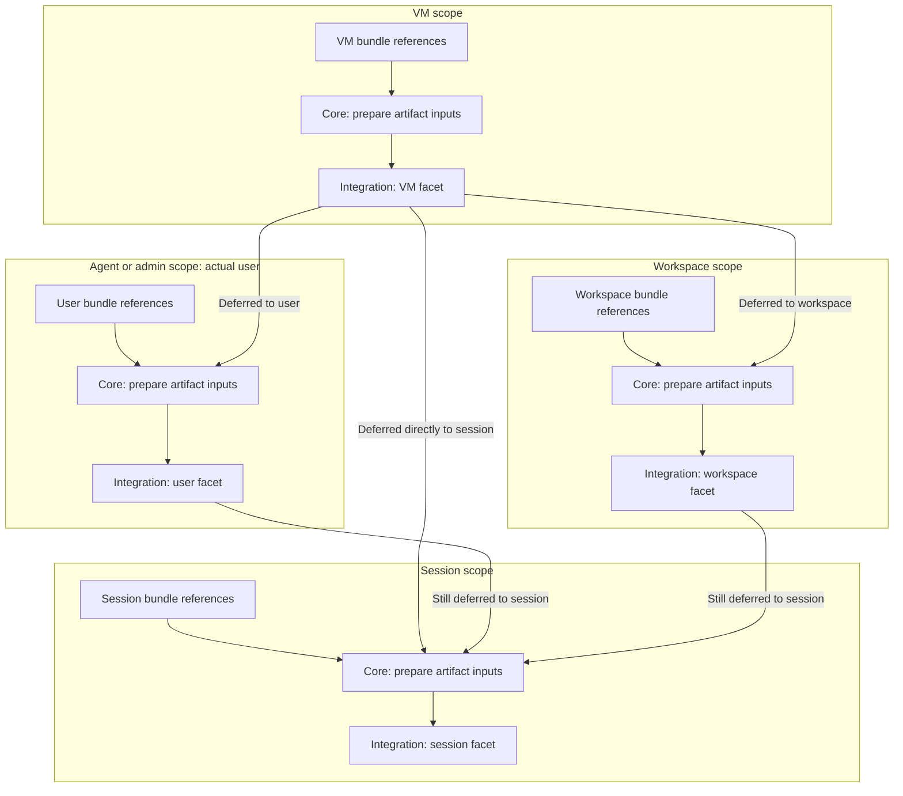

# Agent artifacts: high-level architecture

## Status and architectural choices

Approved HLA responding to the [FRD](frd.md), accepted on 2026-09-13 for the full implementation on
PR 794. The [implementation plan](plan.md) tracks delivery and acceptance; architectural approval
does not claim shipped artifact behavior. [Prior-art research](prior-art-research.md) separates
documented native mechanisms from the behavior still requiring native validation.

The design adds ordinary `artifact-bundle` resources and an `artifacts` block to owning resources.
Core captures and normalizes inputs once for an owning operation. Harness integrations receive those
inputs after env preparation and apply or defer them through the existing facet graph. Integration
results and file ownership use the existing instance-state facility. `agw artifacts show` explains
declarations and recorded delivery through the same graph without applying anything.

The approved first delivery includes workstation and Git sources, hints, rules, standard Agent
Skills and agent personas. Packaged distribution readers, automatic core hint emission and feature
execution follow later. Any artifact still unhandled at the session causes a launch error with
integration-supplied reasons. This policy was accepted with the HLA approval.

## Architecture and flow

The diagram follows artifacts for one integration through one session's actual ancestors. Each
boundary is an owning scope; the integration runs the facet named inside it. The actual user is
either an Agentworks agent user or the admin user, never both in the same path. Other users and
workspaces independently reuse the VM result.

Bundle references can be declared at every scope. Core captures each scope's local bundle content
and combines it with only the applicable incoming deferrals before invoking the integration. Solid
arrows below carry artifact inputs or deferrals. Handled artifacts stop at their facet and do not
travel to inner scopes.



Each deferred artifact takes one route, so VM inputs are not copied down both branches. The session
receives its own artifacts plus the three applicable sets of deferrals. If its facet still cannot
handle an artifact, core applies the approved final-session error policy.

The facet boxes show activated integrations. Without activation, core passes artifacts through: an
inactive VM routes directly to session; an inactive user or workspace passes its applicable inputs
to session. It does not invoke a missing facet or implicitly activate one. The
[routing contract](#facet-results-routing-and-freshness) specifies those cases and stale results.

Env preparation, persistence and native publication mechanics are described separately below. Env
still uses its existing scope resolution and precedence; artifact routing does not change those
semantics. Core prepares applicable env before invoking each integration, and integration-specific
launch env additions are final output rather than new declarations for descendants.

At each core box, the future extension point is **core, then features, then integrations**. Future
producers can add normalized artifacts and env before integrations run. This delivery creates no
feature executor and adds no automatic hints to existing install/auth commands. A generated hint
such as "gh is authenticated" and a declared hint ultimately enter the same artifact input model.

## Resource declarations and ingestion

Register `artifact-bundle` through the ordinary resource-kind registry. It is a declaration with an
identity and dependencies, not a new live resource with its own provision/delete commands. Normal
resource resolution, inheritance, reference inspection and schema generation remain authoritative.
Resolving a resource never fetches its source.

A bundle names logical entries. Each entry has an artifact type and source; hints and rules may
instead carry inline text. Skill sources select one standard skill directory. Agent sources select a
Markdown persona definition with name, description and an instruction body. Supported native persona
options are adapter-owned fields, not a claim of a universal tool/model vocabulary. Hooks and MCP
configuration are not accepted through a persona options escape hatch in this delivery.

Illustrative declaration shape, with final field validation belonging to the resource LLD:

```yaml
kind: artifact-bundle
metadata:
  name: team-artifacts
spec:
  artifacts:
    workspace-note:
      type: hint
      text: "This workspace contains the service and its integration tests."
    conventions:
      type: rule
      source: file::~/agent-content/conventions.md
    review:
      type: skill
      source: git::https://github.com/example/agent-content.git//skills/review?ref=v1.0.0
    reviewer:
      type: agent
      source: file::~/agent-content/reviewer.md
```

Owning VM, admin, agent, workspace and session declarations reference bundles through
`artifacts: {bundles: [team-artifacts]}`. The bundle list uses replacement across template
inheritance, like integration activation lists: omission inherits, a supplied list replaces, and
`[]` removes inherited references for that owner. Repeated bundle references are rejected. This does
not suppress another scope's artifacts. Bundle item names are source identities; a skill's native
name still comes from `SKILL.md`, and an agent's name comes from its definition.

References do not activate integrations. Existing explicit activation syntax remains unchanged:

```yaml
kind: agent-template
metadata:
  name: developer
spec:
  artifacts:
    bundles: [team-artifacts]
  harness_integrations:
    - name: claude-code
    - name: codex
```

Each integration receives the same captured owner inputs and its own ancestor deferrals. It does not
receive another integration's result. Activations can still carry their independent native config;
defaults-only activation is sufficient to opt into artifact handling.

### Capture and refresh

Reuse the existing `SourceRef` grammar and workstation snapshot conventions. Extend shared source
handling with package capture, rather than calling dotfiles' guest checkout or installer workflow.
Git acquisition reads committed objects on the invoking workstation using its existing auth, with no
hooks, checkout filters, export substitution or export-ignore omission. The FRD's complete package,
path, metadata, binary-preservation and bounded-capture rules apply before native writes.

The owner captures its current declared bundles during setup/reinit, or session create/start for
session-owned declarations. One repository/reference resolves to one immutable commit within that
capture. Reinit deliberately refreshes movable references; an exact commit remains pinned. Later
scopes reuse the captured ancestor content without fetching those sources. A changed source needs
its owner's next setup operation; a source failure cannot pass off old content as a new capture.
There is no background updater or new lockfile service.

Use the existing lifecycle entry points: VM and user initialization, workspace creation, and session
create/start. Workspaces currently have no setup refresh operation; changing workspace artifacts or
refreshing their consumed ancestor inputs requires workspace recreation. Workspace repair does not
reapply the facet. This delivery retains that limitation and diagnoses it explicitly rather than
implying an existing workspace reinit command.

Core captures owner inputs even when no integration is activated. This is one common snapshot, not
bookkeeping for every inactive integration. An old owner with no artifact declarations has an empty
contribution. An owner with declared artifacts but no usable capture must be initialized before
descendants can consume them; a session does not silently initialize or refresh an ancestor.
Inspection can still describe uncaptured declarations as unavailable content.

## Normalized representation

Use typed Python models at the pipeline boundary and a versioned JSON codec in existing instance
state. Native generation does not receive filesystem/Git references to resolve. Acquisition
provenance, logical origin and normalized content identity are distinct fields.

| Concept           | Meaning                                                                                                         |
| ----------------- | --------------------------------------------------------------------------------------------------------------- |
| Bundle snapshot   | Captured bundle identity, entry order, source provenance and normalized entries.                                |
| Artifact          | Stable bundle entry key, artifact type, typed content and supporting members.                                   |
| Origin            | Consuming scope/resource, producer and entry address. Core derives the origin facet from its fixed mapping.     |
| Content identity  | Digest of normalized content, relative member paths and executable intent, excluding timestamps and provenance. |
| Deferred artifact | An existing input with its origin unchanged, one destination facet and an integration-supplied reason.          |

Hints and rules carry UTF-8/LF text. Skills retain standard metadata, `SKILL.md` and their complete
member tree. Agents carry name, description, instructions and supported integration-specific
options. Supporting members distinguish normalized text from opaque bytes and retain executable
intent; the codec represents opaque bytes losslessly, for example with base64 within JSON. Exact
codec fields and bounded sizes belong in the LLD, not a new public distribution format.

The normalized representation is independent of source transport. Source readers converge here;
future automatic emissions construct the same typed inputs without pretending to be Git sources. Two
consumers of the same bundle have distinct origins and delivery obligations. A content digest does
not identify an owning resource or authorize deletion of another owner's files.

## Facet results, routing and freshness

Extend the current setup invocation objects with immutable prepared artifact inputs. Setup hooks
return a typed application containing integration-selected file publications and deferrals. Core
executes the common guarded whole-file writes and checkpoints ownership; integrations retain native
format and placement decisions. The result lists only what remains unhandled; omitted inputs are
handled for that integration and owner. Core validates the result at the plugin boundary: inputs
must belong to the invocation, origin must be unchanged, routes must be legal, and each input can be
deferred once. No separate acknowledgment list is added.

Each VM item has one next facet: user, workspace or session. User and workspace can defer only to
session. Routing to a sibling or back outward is invalid. First-party VM facets perform routing
without native file placement: native integrations route toward user handling, while shell can route
directly to session publication. The implementation must explicitly supply these VM hooks;
activation of an unimplemented hook remains a hard error. Shell implements its VM hook so explicit
VM activation remains valid, even though its route matches inactive passthrough.

The VM never examines downstream instances or activations. Its reusable result is evaluated for the
actual user/workspace when those owners run. Handling for one user does not consume the VM result
for another. Only the session joins its own actual user and workspace branches.

For an inactive VM facet, core routes its captured inputs directly to session. It does not copy them
down both branches. An inactive user/workspace facet leaves its applicable routed and local inputs
unhandled for session. Resolution is lazy for the selected integration and actual ancestor path; no
inactive activation records or eager enumeration of every integration are required.

Consequently, native user placement of VM-declared artifacts requires both VM activation to route
them toward user and user activation to handle them there. User activation alone cannot intercept a
VM item routed directly to session. Artifacts declared on the user itself need only user activation
for native user placement. The shipped guide and examples must teach this distinction.

Passthrough is launch-safe when no retained artifact effects compromise the selected integration's
promised delivery. A removed activation with such effects or incomplete artifact cleanup remains
actionable applied state. Require the owning cleanup operation before treating those effects as
absent; for a workspace, that means recreation under the current lifecycle. Do not duplicate
retained artifact content through session passthrough or manufacture records for never-activated
facets. This check adds no barrier for unrelated plugin/settings evidence or artifact-free launches;
existing required/recommended setup semantics continue to govern that evidence.

At convergence, identify inputs by immutable origin and entry identity, not by display name or
content alone. A repeated path to the same input is an invalid route result rather than another
delivery. Independent declarations with the same native name remain distinct and undergo native
collision checks. Stable ordering is VM, actual user, workspace, session, then declared bundle and
entry order within each origin. Ordering is not last-writer-wins precedence.

Persist each activated owner's successful result with the identities of the prepared artifact inputs
actually supplied to that facet, alongside existing config/env dependencies. Reuse is valid while
those inputs match; do not depend on a whole ancestor result's version. A VM change routed only to
workspace cannot stale a user's unchanged inputs. Missing, interrupted or stale active-facet results
require the owner's setup operation, including workspace recreation where applicable. They are not
equivalent to an inactive facet and cannot silently claim old artifacts handled. The check is lazy,
without rerunning an ancestor integration during session start.

## Applied state and file ownership

Use the existing instance-state API and versioned codecs. Add a core artifact-input slice for
captured owner contributions, and extend harness-native setup records with deferrals and owned
artifact outputs. VM and admin contributions remain separate components of the VM owner record;
agent, workspace and session use their actual instance owners. Session applied-state support must be
added to the existing key/domain allowlists, not stored in a separate database or receipt store.

Core snapshots preserve inputs; integration records preserve confirmed effects and reusable results.
Keep these responsibilities separate so an inactive integration needs no fabricated record. Include
artifact content identities in setup freshness. Existing metadata-only plugin claims are not a
lossless artifact snapshot and must not be mistaken for one.

An integration records the paths and native identities it owns, with the previous managed content
identity needed for safe replacement/removal. Applying unchanged inputs is a no-op where possible.
Updating or removing bundles/activations removes obsolete owned files when their ownership still
matches. Unowned or manually changed content is retained and diagnosed; do not adopt it merely
because its filename matches. Use the current checkpoint callback after confirmed effects and
preserve recoverable progress on interruption.

Detect destination conflicts before overwriting files. Different artifact origins must not silently
claim the same native skill/agent identifier. Session preflight also checks ancestor native claims
for collisions across the user/workspace branches, without reintroducing their handled payloads into
the session input. Native plugin namespaces are reported as part of the effective identity. Do not
implement per-key settings ownership, a generic reconciliation engine or global consumption.

Parent deletion keeps its existing behavior. Deleting a VM removes its files with it; artifact
cleanup does not become a prerequisite for VM deletion or an unreachable-backend recovery barrier.

## Session application and isolation

Use the saga's `session_uuid` for durable session ownership and `run_id` for one workload
incarnation. The existing session name remains a display/selection key. The current session row does
not contain these IDs. This effort implements the early shared identity slice permitted by the saga
contract, together with session publication. The
[coordination record](../2026-08-04-next-steps/message-2026-09-13-agent-artifacts-identity-implementation.md)
identifies this ownership; no artifact-specific replacement is introduced.

Private publication lives under the actual user's home, conceptually
`~/.agentworks-artifacts/session/<session_uuid>/<run_id>/`. Parent directories are private to that
Linux user. A workspace can be shared by different users; placing session files there would expose
them more broadly. Sessions sharing one Linux user are not isolated from each other's files, so the
directory protects user boundaries and native application specificity, not same-user secrecy.

Move session env preparation ahead of the integration's launch decision. Extend the prepared session
input with artifacts, actual user/home, prospective session/run identity and applied-state evidence.
The session integration returns its launch decision, deferred result and concrete owned file
publications. This is its application plan; core performs transport/persistence mechanics without
choosing native filenames or interpreting artifact contents.

Validate capture, ancestor freshness, native compatibility, collisions and final deferrals before
tearing down an existing workload. On create, compute the prospective identity for the launch
decision, then persist the session row before publishing owned files, fitting the existing rollback
boundary. On restart, stage files under the new run directory so preflight or publication failure
does not overwrite files used by the old workload. Only after preparation succeeds does core stop
the old runtime and launch the new one. Record confirmed publication before launch and retain enough
ownership evidence to clean up a failed start idempotently.

Retire the previous run's owned files after it is no longer using them. Session deletion and failed
creation clean only the directories belonging to that session/run. Reusing a session name cannot
adopt another UUID's files. An unsupported resume or stale native prompt must fail explicitly before
teardown; silently continuing with an old artifact set is not successful delivery.

## First-party delivery matrix

The table selects first-delivery behavior from documented mechanisms. Native compatibility probes
and live acceptance still gate shipping it. Unsupported means a reasoned deferral at an outer facet
and a launch error if no later facet handles it.

| Integration | User facet                                                                            | Workspace facet                                                                               | Session facet                                                                                                                   |
| ----------- | ------------------------------------------------------------------------------------- | --------------------------------------------------------------------------------------------- | ------------------------------------------------------------------------------------------------------------------------------- |
| Shell       | Publish all types as files below the actual user's `.agentworks-artifacts` directory. | Publish all types in a workspace-owned artifact directory, deliberately shared at this scope. | Publish all remaining types in the private session/run directory.                                                               |
| Claude Code | Unconditional `.claude/rules`; standard `.claude/skills`; `.claude/agents`.           | Corresponding project directories owned by the workspace.                                     | Additive prompt file for hints/rules; session-only plugin for skills; `--agents` definitions for agents.                        |
| Codex       | Native `.agents/skills` and `.codex/agents`; defer hints/rules to session.            | Native project skills/agents; defer hints/rules to session.                                   | Additional `developer_instructions` for hints/rules; private agent TOML files selected by config overrides; skills unsupported. |
| Grok Build  | Native `.grok` rules, skills and agents.                                              | Corresponding project directories, with discovery exclusions checked.                         | Additive `--rules` text and `--agents` definitions; interactive session skills unsupported pending proof of a native mechanism. |

Codex rule deferral is deliberate: its single-file AGENTS.md discovery, overrides and size cap do
not supply a simple additive owned rule fragment. The session integration composes artifact text
with existing configured `developer_instructions` into one native value rather than overwriting
those instructions or editing a shared file. Native execution-policy `.rules` files are unrelated.

Claude similarly composes existing append instructions with generated hint/rule text. Its private
session plugin is an integration-generated carrier, not workspace marketplace/plugin installation.
Skill names acquire the documented plugin namespace, for example `agentworks-artifacts:review`;
inspection reports that name. Persona JSON avoids assuming that plugin persona fields are all
preserved. Required resume behavior must be tested with the native prompt-snapshot setting.

Grok uses a flat rules directory and honors discovery exclusions. Its interactive CLI must be
verified directly; ACP plugin flags are not evidence of support in the launched command. Persona
options that the selected native mechanism cannot preserve receive an explicit unsupported result.

Registering an agent persona makes a definition available; choosing it as the primary persona is a
separate native launch behavior. Claude supports that selection. Codex's existing primary `agent`
config is prompt-mediated and does not promise full persona settings. Preserve that distinction in
the CLI guidance and inspection output instead of claiming primary/delegated parity.

Shell exposes the session publication index through `AGENTWORKS_ARTIFACTS_DIR`; its index records
types, relative files and provenance for that session/run only. Ancestor publications use fixed
locations: `~/.agentworks-artifacts/user/` for the actual user and
`<workspace>/.agentworks-artifacts/` for the workspace. Document these locations without adding
ancestor-index pointers or retransmitting handled payloads. Publication and discoverability fulfill
shell delivery; shell does not claim to load rules into model context.

Across integrations, hints may be combined into a single context fragment. Rules remain
always-context guidance within their applicability. Standard skills retain their package and
progressive discovery semantics. Native policy that prevents promised discovery or loading must be
diagnosed; mere file existence is not a substitute for the documented delivery contract. Native
launch overrides that replace or disable the artifact carrier must be rejected before teardown; for
example, raw arguments must not silently replace composed developer instructions. Each adapter owns
conflict checks for its generated native options.

## Inspection and worked behavior

Add `agw artifacts show` beside `agw env show`, with thin CLI parsing and a typed projection
service. Support VM, actual admin/agent user, workspace and session selection. Reuse familiar
selectors; an explicit admin selector avoids treating a workspace as though it had an admin
ancestor.

```sh
agw artifacts show --vm dev
agw artifacts show --vm dev --admin
agw artifacts show --agent developer
agw artifacts show --workspace service
agw artifacts show --session review
agw artifacts show --session review --integration codex
```

Multiple selectors must identify the same actual lineage. Without an integration filter, show the
declared inputs plus relevant activated/recorded integrations, not every installed plugin. The
filter can also explain an inactive integration's passthrough. No lookup applies a facet or fetches
an uncaptured source.

The projection includes local and applicable ancestor artifacts, even when already handled upstream.
Show origin, bundle/item, type, captured source revision, current declaration/capture relationship,
integration activation, recorded handling or deferral reason/route, and native identity/placement.
Uncaptured bundles remain visible as references with unknown contents. Missing, stale or interrupted
evidence is explicit; a recorded successful apply is not a live filesystem or model attestation.
Default output explains metadata without dumping artifact bodies or secret values.

Worked cases the HLA and subsequent tests share:

1. **Inactive VM and user.** VM core has captured a rules bundle. Neither ancestor activates Codex.
   Core carries its input directly to the selected Codex session. The session injects rule text; it
   performs no implicit user setup. `show` identifies VM origin and the inactive passthrough.
2. **Upstream skills.** An agent user activates Codex and applies a skill bundle. Its sessions do
   not receive those skill payloads again. Inspection still lists the user placement and recorded
   handling. Without upstream handling, the same session skill would fail with an unsupported
   private-session-placement reason and identify which owner needs configuration.
3. **The diamond.** A VM facet routes one entry to user, another to workspace and a third directly
   to session. Each branch sees only its assigned VM entries plus its own local declarations. A
   session joins the three disjoint results; a second user gets an independent evaluation.
4. **Two users in one workspace.** Workspace artifacts are intentionally shared. Session-owned
   Claude skills are loaded from each actual user's private session plugin. No session artifact is
   installed into the shared project directory.
5. **Change and removal.** Updating a Git ref and reinitializing its owner captures a new commit and
   applies/removes owned outputs. Only descendants whose actual prepared inputs change become stale.
   Inspection explains the mismatch and launch requests the applicable owner setup operation,
   explicitly workspace recreation when required, instead of silently mixing revisions or repairing
   ancestors. A removed activation with retained effects still requires retirement before
   passthrough.

## Implementation boundaries and review gates

The existing code supplies concrete seams, not an existing artifact implementation:

| Area                                                        | Extension                                                                                                 |
| ----------------------------------------------------------- | --------------------------------------------------------------------------------------------------------- |
| Resource registry and owning templates                      | Bundle kind, typed references and artifacts block through ordinary resolution/provenance.                 |
| `sources.py`                                                | Validated workstation/Git package capture beside existing parsing/snapshots.                              |
| `harness_setup/inputs.py` and `lifecycle.py`                | Common captured owner contribution and prepared env/artifacts.                                            |
| Integration setup invocations and `start`                   | Typed input/deferral contract and session publication/launch output; explicit contract-version migration. |
| `harness_setup/model.py`, `state.py`, instance-state codecs | Captures, reusable results and owned outputs with session support.                                        |
| Session create/start lifecycle                              | Prepare before teardown, persist ownership before publication, preserve failure cleanup.                  |
| Artifact inspection service/CLI                             | Read-only projection over declarations, actual ancestors and recorded state.                              |

Do not treat an old setup hook's `None` return as having handled new artifact inputs. Bump the
integration contract and update shipped integrations together; unsupported implementations must fail
clearly. Existing records without artifact fields can remain valid for artifact-free declarations,
but cannot claim artifact capture or handling. Codec migration must preserve existing plugin claims
and settings behavior, with no broad refactor of VM deletion.

Before wiring lifecycle consumers, complete the shared session-identity slice and the bounded
source/codec and native-adapter LLDs. Validate capture with local Git and filesystem fixtures,
including filters, LFS/submodule refusal, executable scripts, links, portable collisions, an
ASCII-only PDF and byte preservation exceptions. Validate routing with simple test integrations,
including inactive/stale owners and diamond reuse. Validate native discovery, updates, removal,
resume and two-user isolation against the actual shipped executables and a scoped live backend.
Inspection tests must prove no acquisition, native invocation or state mutation occurs.

The operator approved capture during owning setup, single-destination deferrals, the final-session
error and the native session skill limitations. The [implementation plan](plan.md) sequences the
complete delivery on this branch and PR, including the shared identity prerequisite and acceptance.
